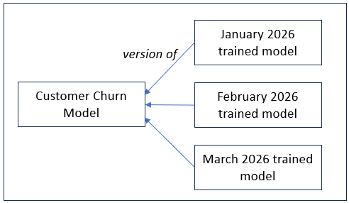

<i>This appendix accompanies [***Semantic Webs of Meaning: Building Contextual Knowledge Graphs for Deduction and Integration***](https://technicspub.com/semantic-webs-of-meaning/) by Eugene Asahara, published by [Technics Publications](https://technicspub.com).</i>

# Appendix E: Machine Learning Models as Knowledge Graph Artifacts

Machine learning models can become part of a knowledge graph in at least three ways.

| Way the model becomes part of the KG | Description                                                                                                                                                                                                                                                                                                                                                                 |
| ------------------------------------ | --------------------------------------------------------------------------------------------------------------------------------------------------------------------------------------------------------------------------------------------------------------------------------------------------------------------------------------------------------------------------- |
| **Model and critical metadata**      | Represent the model itself as a graph resource together with important metadata such as model type, name, parameters, creation date, version, creator, training process, and provenance.                                                                                                                                                                                    |
| **Semantic output**                  | Store meaningful results produced by the model, such as clusters, classes, predictions, topics, associations, embeddings, detected objects, risk scores, or transformed signals. These outputs can then participate directly in the knowledge graph.                                                                                                                        |
| **Model artifact reference**         | Link from the KG back to the richer native artifact, such as a pickle file, ONNX file, neural-network weights, decision-tree export, audio file, image, video, feature set, or transform output. The graph does not need to flatten the entire artifact into triples; it can describe the artifact, connect it to meaning, and preserve a reference to the original object. |


A basic RDF pattern for uploading a model into a KG is:

```turtle
# Model123 is the trained KMeans model whose configuration, output, and serialized artifact are tracked in the graph.
:Model123
    a kg:MachineLearningModel ;
    kg:modelType "KMeans" ;
    kg:hasParameter :Parameter_k ;
    kg:hasOutput :IrisClusterOutput ;
    kg:modelArtifactUrl "https://example.org/models/iris_kmeans.pkl"^^xsd:anyURI .

# Parameter_k records the KMeans parameter k, which specifies how many clusters the algorithm should create.
:Parameter_k
    a kg:ModelParameter ;
    rdfs:label "Number of clusters" ;
    kg:parameterName "k" ;
    kg:parameterValue 3 .

# IrisClusterOutput represents the complete set of cluster assignments produced by Model123.
:IrisClusterOutput
    a kg:ClusterAssignmentSet ;
    rdfs:label "Iris KMeans cluster output" ;
    kg:producedBy :Model123 ;
    kg:containsCluster
        :IrisCluster_0,
        :IrisCluster_1,
        :IrisCluster_2 .

# IrisCluster_0 is one of the three unlabeled clusters discovered by the KMeans model.
:IrisCluster_0
    a kg:Cluster ;
    rdfs:label "Iris cluster 0" .

# IrisCluster_1 is one of the three unlabeled clusters discovered by the KMeans model.
:IrisCluster_1
    a kg:Cluster ;
    rdfs:label "Iris cluster 1" .

# IrisCluster_2 is one of the three unlabeled clusters discovered by the KMeans model.
:IrisCluster_2
    a kg:Cluster ;
    rdfs:label "Iris cluster 2" .
```
Here, :Parameter_k preserves an important part of the model configuration: K-Means was instructed to produce three clusters. :IrisClusterOutput represents the resulting set of cluster assignments, while the individual cluster nodes make those outputs addressable from the graph. The serialized .pkl file preserves the trained K-Means model itself. The knowledge graph therefore records both what the model produced and the artifact that produced it.

A trained model represents **learned knowledge**. Depending on the model family, that knowledge may take the form of cluster centers and groupings, coefficients, associations, decision paths, classifications, or other learned structures. In that sense, models can play a role similar to business rules: they encode knowledge that can be used to reach conclusions from new inputs. Akin to the well-known saying, "Correlation doesn't imply causation", **Successful prediction does not imply understanding**. A model may score churn, risk, or demand accurately while still offering no account of the situation that a person—or a rule you can inspect—could follow. The graph’s job is to preserve what was learned, what was predicted, and what artifact produced it, not to pretend that a high score is an explanation.

Some model families—especially decision trees, rule learners, and association-rule miners—make that knowledge particularly explicit by producing decision logic. Their rules may contain feature thresholds, combinations of conditions, nested paths, confidence or lift measures, and resulting conclusions. Where useful, this logic can be represented directly in the knowledge graph, commonly using SWRL or another rule language, while retaining a link to the original model artifact. This preserves both the machine-readable logic and the richer model from which it came.

**SWRL (Semantic Web Rule Language)** provides a natural way to encode these rules inside the knowledge graph itself. Because SWRL is designed to work directly with OWL classes and properties, the same multi-condition logic that a decision tree or association model discovers can be expressed as executable rules that reasoners can apply. The rules remain tightly connected to the original model artifact, the features they use, and the entities they classify or recommend.

Here is a concrete example of a multi-factor rule that might be extracted from a decision tree:

```swrl
Customer(?c) 
^ hasWaitTimeSeconds(?c, ?wait) 
^ swrlb:greaterThan(?wait, 180) 
^ hasOrderValue(?c, ?value) 
^ swrlb:lessThan(?value, 25.00) 
^ hasPreviousVisits(?c, ?visits) 
^ swrlb:lessThan(?visits, 3) 
→ hasRiskLevel(?c, HighDepartureRisk)
```

This rule combines three conditions (long wait time, low order value, and few previous visits) to assert a high departure risk. The same pattern works for more complex combinations of factors.

In short, machine learning does not merely sit outside the knowledge graph. It can create nodes, relationships, classifications, scores, **candidate rules**, and semantic categories. When those rules are expressed in SWRL, the graph turns model-derived logic into addressable, inspectable, and reusable knowledge while still preserving the deeper evidence in the linked model artifact.

## Machine Learning Model Examples

The examples in this appendix use a common set of parts: **parameters**, **inputs**, **outputs**, and the **knowledge-graph role** of the resulting model or artifact. Although the details vary by model family, it is helpful to think of a machine-learning model in the KG as having these related parts:

| Part                               | Description                                                                                                                                                            |
| ---------------------------------- | ---------------------------------------------------------------------------------------------------------------------------------------------------------------------- |
| **Model artifact**                 | The executable or stored model itself, such as a pickle file, ONNX file, set of neural-network weights, exported decision tree, or transform artifact.                 |
| **Model type**                     | The kind of model or algorithm used, such as K-Means, random forest, regression, neural network, or anomaly detector.                                                  |
| **Parameters and configuration**   | The settings that define how the model was trained or executed.                                                                                                        |
| **Inputs and features**            | The data, measurements, attributes, signals, documents, or other values supplied to the model.                                                                         |
| **Outputs**                        | Predictions, classes, clusters, scores, associations, vectors, forecasts, detected patterns, or other model results.                                                   |
| **Semantic interpretation**        | The domain meaning assigned to model outputs. A cluster might become a customer segment, an anomaly a suspicious event, or a classification a risk category.           |
| **Rules or decision logic**        | Usable logic exposed by the model, such as decision-tree branches or selected association rules, which may be represented explicitly in SWRL or another rule language. |
| **Provenance**                     | Information about which model produced a result, which version was used, what inputs or feature set were involved, and when the result was produced.                   |
| **Model artifact reference**       | A link from the knowledge graph back to the richer native artifact when converting the artifact itself into triples would be impractical or would lose useful detail.  |
| **Quality or confidence measures** | Probability, confidence, lift, error margin, anomaly score, similarity score, or other measures describing the strength, quality, or uncertainty of a model output.    |

The KG does not necessarily store all of these parts directly. Its role is to capture the portions that carry useful meaning and connect them to the deeper model artifacts and evidence from which that meaning was derived.


### Clustering Models

Clustering models group similar records without requiring pre-labeled outcomes. Examples include K-Means, DBSCAN, hierarchical clustering, and Gaussian mixture models.

A cluster can be represented as a model-output individual, while its semantic interpretation may become a candidate class, segment, concept, or category.

| Aspect     | Examples                                                                        |
| ---------- | ------------------------------------------------------------------------------- |
| Parameters | Number of clusters, distance metric, random seed, minimum cluster size          |
| Inputs     | Measurements, feature vectors, embeddings, behavioral attributes                |
| Outputs    | Cluster ID, centroid, member count, cluster label, distance from centroid       |
| KG use     | Represent cluster outputs and connect them to learned subclasses, customer segments, product groups, or behavioral groups. |

Example:

```turtle
ex:IrisCluster_SetosaLike
    a owl:Class ;
    rdfs:subClassOf ex:Iris ;
    rdfs:label "Setosa-like Iris" .

ex:IrisKMeansCluster_1
    a owl:NamedIndividual, ex:MachineLearnedCluster ;
    ex:generatedBy ex:IrisKMeansModel ;
    ex:representsLearnedClass ex:IrisCluster_SetosaLike ;
    ex:clusterId 1 ;
    ex:memberCount 50 ;
    ex:sepalLengthCentroid 5.006 ;
    ex:sepalWidthCentroid 3.428 ;
    ex:petalLengthCentroid 1.462 ;
    ex:petalWidthCentroid 0.246 .
```
IrisCluster_SetosaLike represents the learned category and is therefore an OWL class. IrisKMeansCluster_1 represents the concrete cluster produced by this particular trained model and is therefore an individual. The centroid, member count, cluster ID, and provenance describe that particular model result.


#### Clustering Models (SWRL examples)

Clustering models discover groups without labeled outcomes. Once a model has been trained, the resulting clusters can be represented as OWL classes. SWRL can then be used in two different ways: to express human-readable rules that approximate regions associated with the learned clusters, or, where the model permits it, to reproduce the model's actual classification logic. The first examples below illustrate the approximation approach. The final example shows how the nearest-centroid logic of K-Means itself can be represented.

#### Simple Feature-Range Approximation

A simple way to summarize a learned cluster is to construct an interpretable rule around characteristic feature ranges:

```swrl
Iris(?i) 
^ hasSepalLength(?i, ?sl) 
^ swrlb:greaterThanOrEqual(?sl, 4.8) 
^ swrlb:lessThanOrEqual(?sl, 5.2) 
→ IrisCluster_SetosaLike(?i)
```

This rule treats an Iris whose sepal length falls in this range as Setosa-like. It is a human-readable approximation of the learned cluster, not the actual K-Means assignment algorithm.

#### Multi-Feature Cluster Approximation

A richer approximation can use several dimensions of the learned cluster at once:

```swrl
Iris(?i) 
^ hasSepalLength(?i, ?sl) 
^ swrlb:greaterThanOrEqual(?sl, 4.7) 
^ swrlb:lessThanOrEqual(?sl, 5.3) 
^ hasSepalWidth(?i, ?sw) 
^ swrlb:greaterThanOrEqual(?sw, 3.2) 
^ swrlb:lessThanOrEqual(?sw, 3.6) 
^ hasPetalLength(?i, ?pl) 
^ swrlb:lessThanOrEqual(?pl, 1.9) 
→ IrisCluster_SetosaLike(?i)
```

This produces a more informative semantic approximation of the Setosa-like cluster, but the rectangular feature ranges still do not reproduce K-Means's actual nearest-centroid decision boundary.

#### Alternative Approximation for Another Cluster

```swrl
Iris(?i) 
^ hasPetalLength(?i, ?pl) 
^ swrlb:greaterThan(?pl, 4.5) 
^ hasPetalWidth(?i, ?pw) 
^ swrlb:greaterThan(?pw, 1.5) 
→ IrisCluster_VirginicaLike(?i)
```

Different learned clusters can be summarized with different combinations of feature thresholds. Such rules are useful because they are simple and interpretable, but they should be understood as model-derived approximations rather than literal K-Means decision rules.
#### Linking the Rule Back to the Model Artifact

As with decision trees, the knowledge graph should preserve provenance by connecting the SWRL rule to the clustering model that produced the clusters:

```turtle
ex:SetosaLikeApproximationRule
    a ex:ClusterMembershipRule ;
    ex:derivedFromModel ex:IrisKMeansModel ;
    ex:expressedAsSWRL """
        Iris(?i)
        ^ hasSepalLength(?i, ?sl)
        ^ swrlb:greaterThanOrEqual(?sl, 4.7)
        ^ swrlb:lessThanOrEqual(?sl, 5.3)
        ^ hasSepalWidth(?i, ?sw)
        ^ swrlb:greaterThanOrEqual(?sw, 3.2)
        ^ swrlb:lessThanOrEqual(?sw, 3.6)
        ^ hasPetalLength(?i, ?pl)
        ^ swrlb:lessThanOrEqual(?pl, 1.9)
        → IrisCluster_SetosaLike(?i)
    """ ;
    ex:approximatesCluster ex:IrisCluster_SetosaLike ;
    ex:usesFeature ex:SepalLength, ex:SepalWidth, ex:PetalLength ;
    ex:modelArtifactUrl
        "https://example.org/models/iris_kmeans.pkl"^^xsd:anyURI .
```
#### Reproducing K-Means Membership with SWRL

The preceding rules deliberately simplify the learned clusters into readable feature ranges. K-Means itself uses a different rule: a new observation is assigned to the cluster whose centroid is closest in the model's feature space. Because the Iris model stores the four learned centroid coordinates, this calculation can also be represented explicitly in SWRL.

```turtle
Iris(?i)
^ hasSepalLength(?i, ?sl)
^ hasSepalWidth(?i, ?sw)
^ hasPetalLength(?i, ?pl)
^ hasPetalWidth(?i, ?pw)

^ swrlb:subtract(?d1, ?sl, 5.006)
^ swrlb:multiply(?d1sq, ?d1, ?d1)

^ swrlb:subtract(?d2, ?sw, 3.428)
^ swrlb:multiply(?d2sq, ?d2, ?d2)

^ swrlb:subtract(?d3, ?pl, 1.462)
^ swrlb:multiply(?d3sq, ?d3, ?d3)

^ swrlb:subtract(?d4, ?pw, 0.246)
^ swrlb:multiply(?d4sq, ?d4, ?d4)

^ swrlb:add(?s1, ?d1sq, ?d2sq)
^ swrlb:add(?s2, ?d3sq, ?d4sq)
^ swrlb:add(?distance, ?s1, ?s2)

→ distanceToSetosaCentroid(?i, ?distance)
```
Equivalent rules calculate the distances to the Versicolor-like and Virginica-like centroids. The square root is unnecessary because comparing squared Euclidean distances produces the same ordering.
```turtle
Iris(?i)
^ distanceToSetosaCentroid(?i, ?ds)
^ distanceToVersicolorCentroid(?i, ?dv)
^ distanceToVirginicaCentroid(?i, ?dvi)
^ swrlb:lessThan(?ds, ?dv)
^ swrlb:lessThan(?ds, ?dvi)

→ IrisCluster_SetosaLike(?i)
```
Similar comparison rules infer the Versicolor-like and Virginica-like classes. Unlike the preceding feature-range examples, these rules express the nearest-centroid logic used by the trained K-Means model itself. The complete executable version can be retained with the source code rather than reproduced in full here.

### Decision Trees and Rule Models

Decision trees are useful because their logic can often be represented as explicit rules. A tree splits data based on feature thresholds and produces a classification, prediction, or score.

In a knowledge graph, a decision tree can contribute rules, decision paths, risk explanations, or derived classifications.

| Aspect     | Examples                                                                            |
| ---------- | ----------------------------------------------------------------------------------- |
| Parameters | Max depth, minimum samples per leaf, split criterion, pruning settings              |
| Inputs     | Customer attributes, case facts, measurements, event properties                     |
| Outputs    | Class label, probability, decision path, feature thresholds                         |
| KG use     | Explainable rules, risk categories, decision justifications, SHACL-like constraints |

Example:

```turtle
ex:HighDepartureRiskRule
    a ex:DecisionRule ;
    ex:generatedBy ex:DepartureRiskTree ;
    ex:usesFeature ex:WaitTimeSeconds ;
    ex:thresholdValue 180 ;
    ex:predicts ex:HighDepartureRisk .
```

#### Decision Trees and Rule Models SWRL examples

Decision trees are especially valuable in a knowledge graph because their decision paths can often be expressed as explicit, machine-readable rules. When a tree is exported, each path from root to leaf becomes a candidate rule that can be represented in SWRL (or Prolog, SHACL, or other rule languages).

#### Simple single-threshold rule

The following SWRL rule is a decision tree example:

```swrl
Customer(?c) 
^ hasWaitTimeSeconds(?c, ?wait) 
^ swrlb:greaterThan(?wait, 180) 
→ hasRiskLevel(?c, HighDepartureRisk)
```

This rule states:  
If a customer has a wait time greater than 180 seconds, then assert that the customer has a high departure risk.

#### Multi-factor decision path

Real decision trees usually combine several conditions. Here is a more realistic path that might come from a departure-risk tree:

```swrl
Customer(?c) 
^ hasWaitTimeSeconds(?c, ?wait) 
^ swrlb:greaterThan(?wait, 180) 
^ hasOrderValue(?c, ?value) 
^ swrlb:lessThan(?value, 25.00) 
^ hasPreviousVisits(?c, ?visits) 
^ swrlb:lessThan(?visits, 3) 
→ hasRiskLevel(?c, HighDepartureRisk)
```

This captures a typical leaf node: long wait **and** low order value **and** few previous visits → high risk of departure.

#### Alternative path with different thresholds

```swrl
Customer(?c) 
^ hasWaitTimeSeconds(?c, ?wait) 
^ swrlb:greaterThan(?wait, 300) 
^ hasOrderValue(?c, ?value) 
^ swrlb:greaterThanOrEqual(?value, 25.00) 
→ hasRiskLevel(?c, MediumDepartureRisk)
```

Even when the wait is longer, a higher order value can reduce the predicted risk level.

#### Linking the rule back to the model artifact

In the knowledge graph you can still keep the provenance of the rule itself:

```turtle
ex:HighDepartureRiskRule_01
    a ex:DecisionRule ;
    ex:generatedBy ex:DepartureRiskTree_v3 ;
    ex:expressedAsSWRL """
        Customer(?c) 
        ^ hasWaitTimeSeconds(?c, ?wait) 
        ^ swrlb:greaterThan(?wait, 180) 
        ^ hasOrderValue(?c, ?value) 
        ^ swrlb:lessThan(?value, 25.00) 
        ^ hasPreviousVisits(?c, ?visits) 
        ^ swrlb:lessThan(?visits, 3) 
        → hasRiskLevel(?c, HighDepartureRisk)
    """ ;
    ex:usesFeature ex:WaitTimeSeconds, ex:OrderValue, ex:PreviousVisits ;
    ex:predicts ex:HighDepartureRisk ;
    ex:modelArtifactUrl "https://example.org/models/departure_risk_tree_v3.pkl"^^xsd:anyURI .
```
#### Decision Forests

Decision trees are powerful because their logic is transparent and can be extracted as explicit rules. A natural extension of this idea is the **decision forest** (most commonly realized as a random forest).

A decision forest is an ensemble of many individual decision trees. Each tree is trained on a different random subset of the data and a random subset of the features. When a prediction is needed, the trees vote (for classification) or average their outputs (for regression). The final result is therefore the collective judgment of the forest rather than the judgment of any single tree.

This approach brings several important benefits. First, it dramatically reduces overfitting. A single deep tree can memorize noise in the training data; a forest of shallower, diversified trees generalizes far more reliably. Second, decision forests are robust to noisy features and missing values, and they scale well to high-dimensional data. Third, they still provide valuable insight: feature-importance scores can be derived from how often and how effectively each attribute is used across the trees, giving a ranking of what drives the model’s decisions.

From a knowledge-graph perspective, decision forests occupy an interesting middle ground. The overall model is more accurate and stable than a single tree, yet individual trees within the forest remain extractable as rules. Organizations can therefore keep the high-performing ensemble as the operational model artifact while selectively promoting the clearest or most business-relevant trees into SWRL (or other) rules that live directly in the graph. In this way the knowledge graph benefits from both the predictive strength of the forest and the transparency of the underlying decision logic.

---


### Association Rule Models

Association rule mining finds patterns such as “items or events that tend to occur together.” Classic outputs include support, confidence, and lift.

In a knowledge graph, association rules can become probabilistic or evidential relationships between concepts, products, events, or behaviors.

| Aspect     | Examples                                                                   |
| ---------- | -------------------------------------------------------------------------- |
| Parameters | Minimum support, minimum confidence, minimum lift                          |
| Inputs     | Baskets, transactions, event sets, observed co-occurrences                 |
| Outputs    | Antecedent, consequent, support, confidence, lift                          |
| KG use     | Recommendation links, co-occurrence relationships, behavioral associations |

Example:

```turtle
ex:Rule_BreadButter
    a ex:AssociationRule ;
    ex:antecedent ex:Bread ;
    ex:consequent ex:Butter ;
    ex:support 0.12 ;
    ex:confidence 0.68 ;
    ex:lift 1.9 .
```

The graph can use this as a weak semantic connection: not a logical truth, but a discovered relationship.


#### Association Rule Models SWRL examples

Association rule models discover co-occurrence patterns such as “customers who buy X also tend to buy Y.” Once these patterns have been mined, they can be turned into explicit relationships in the knowledge graph and expressed as SWRL rules. Because association rules are statistical rather than strictly logical, the SWRL versions are best treated as *suggestive* or *evidential* implications rather than absolute truths.

#### Simple single-antecedent rule

```swrl
Customer(?c) 
^ hasPurchased(?c, Bread) 
→ recommendedProduct(?c, Butter)
```

This rule states that if a customer has purchased Bread, then Butter can be recommended to them. In a knowledge graph this creates a model-generated recommendation link.

#### Multi-item antecedent rule

Real association rules often involve several items in the antecedent:

```swrl
Customer(?c) 
^ hasPurchased(?c, Bread) 
^ hasPurchased(?c, Milk) 
→ recommendedProduct(?c, Butter)
```

A slightly stronger version that also records the association itself:

```swrl
Customer(?c) 
^ hasPurchased(?c, Bread) 
^ hasPurchased(?c, Milk) 
→ hasAssociatedProduct(?c, Butter)
```

#### Rule with confidence-style filtering (using a numeric property)

If the original association rule carries a confidence score, you can surface that score as a property and optionally filter on it:

```swrl
Customer(?c) 
^ hasPurchased(?c, Diapers) 
^ hasPurchased(?c, Beer) 
→ recommendedProduct(?c, Chips)
```

(The confidence and lift values remain attached to the rule resource in the graph rather than being hard-coded inside every SWRL rule.)

#### Linking the rule back to the model artifact

As with decision trees and clusters, the knowledge graph should preserve full provenance:

```turtle
ex:BreadMilk_Butter_Association
    a ex:AssociationRule ;
    ex:generatedBy ex:MarketBasketModel_v2 ;
    ex:antecedent ex:Bread, ex:Milk ;
    ex:consequent ex:Butter ;
    ex:support 0.09 ;
    ex:confidence 0.71 ;
    ex:lift 2.3 ;
    ex:expressedAsSWRL """
        Customer(?c) 
        ^ hasPurchased(?c, Bread) 
        ^ hasPurchased(?c, Milk) 
        → recommendedProduct(?c, Butter)
    """ ;
    ex:modelArtifactUrl "https://example.org/models/market_basket_v2.pkl"^^xsd:anyURI .
```


### Neural Networks

Neural networks are usually too large and opaque to represent directly as triples. The graph should normally store metadata about the model, its inputs, outputs, performance, and artifact location.

In a knowledge graph, neural networks are most useful as linked artifacts that produce semantic outputs: image labels, text classifications, embeddings, audio classifications, anomaly scores, or recommendations.

| Aspect     | Examples                                                                  |
| ---------- | ------------------------------------------------------------------------- |
| Parameters | Architecture, layer count, embedding size, training epochs, learning rate |
| Inputs     | Images, text, audio, video, feature vectors, sequences                    |
| Outputs    | Classification, embedding, score, generated label, detected object        |
| KG use     | Link semantic outputs to the model artifact that generated them           |

Example:

```turtle
ex:ImageClassifierV1
    a ex:NeuralNetworkModel ;
    ex:modelArtifactUrl "https://example.org/models/image_classifier.onnx"^^xsd:anyURI ;
    ex:inputType "image" ;
    ex:outputType "object classification" ;
    ex:hasOutput ex:DetectedDog .
```

The graph does not need to explain every weight in the neural network. It needs to preserve what the network found and where the model artifact lives.

---

### Embedding Models

Embedding models convert text, images, entities, or other objects into vectors. The vector itself may be stored in a vector database, while the knowledge graph stores the object identity, model used, and semantic relationships discovered from similarity.

| Aspect     | Examples                                                                 |
| ---------- | ------------------------------------------------------------------------ |
| Parameters | Embedding dimension, model name, distance metric, context window         |
| Inputs     | Text, images, entities, documents, graph nodes                           |
| Outputs    | Vector, nearest neighbors, similarity scores                             |
| KG use     | Semantic search, related concepts, entity alignment, duplicate detection |

Example:

```turtle
ex:CustomerPolicyDocument
    a ex:Document ;
    ex:embeddedBy ex:TextEmbeddingModel ;
    ex:vectorStoreUrl "https://example.org/vectorstores/policies"^^xsd:anyURI ;
    ex:similarTo ex:CancellationPolicy .
```

The vector may live outside the graph, but the graph can keep the semantic trail.

---

### Classification Models

Classification models assign records to known categories. Examples include logistic regression, random forests, support vector machines, gradient boosting, and neural classifiers.

In a knowledge graph, classification outputs can become typed assertions, risk labels, status labels, or evidence-backed claims.

| Aspect     | Examples                                                              |
| ---------- | --------------------------------------------------------------------- |
| Parameters | Model type, threshold, feature set, class labels                      |
| Inputs     | Record features, customer profile, transaction attributes             |
| Outputs    | Predicted class, probability, confidence, feature importance          |
| KG use     | Add classifications, risk labels, eligibility decisions, review flags |

Example:

```turtle
ex:Customer123
    ex:classifiedBy ex:ChurnClassifier ;
    ex:hasPredictedClass ex:HighChurnRisk ;
    ex:predictionProbability 0.82 .
```

This helps because the graph can connect a model prediction to the entity it describes.

---

### Regression Models

Regression models predict numeric values. They may predict price, demand, cost, time to completion, failure probability, expected wait time, or lifetime value.

In a knowledge graph, regression outputs can become estimated attributes or forecasted measurements.

| Aspect     | Examples                                                   |
| ---------- | ---------------------------------------------------------- |
| Parameters | Coefficients, regularization, training window, feature set |
| Inputs     | Numeric and categorical features                           |
| Outputs    | Predicted value, error range, confidence interval          |
| KG use     | Forecasted metrics, expected values, planning assumptions  |

Example:

```turtle
ex:Shipment456
    ex:predictedBy ex:DeliveryTimeRegressionModel ;
    ex:predictedDeliveryHours 38.5 ;
    ex:predictionErrorMarginHours 4.0 .
```

The prediction becomes part of the graph, but it should remain linked to the model and features that produced it.

---

### Time-Series Models

Time-series models analyze values over time. Examples include ARIMA, exponential smoothing, Prophet-style models, recurrent neural networks, and temporal forecasting models.

In a knowledge graph, time-series outputs can describe trends, seasonality, anomalies, forecasts, and expected future values.

| Aspect     | Examples                                                          |
| ---------- | ----------------------------------------------------------------- |
| Parameters | Time window, lag order, seasonality, forecast horizon             |
| Inputs     | Dated observations, metrics, sensor values, financial values      |
| Outputs    | Forecast, trend, seasonality, anomaly, confidence range           |
| KG use     | Attach forecasts and trend states to business entities or metrics |

Example:

```turtle
ex:WeeklyDemandForecast
    a ex:Forecast ;
    ex:generatedBy ex:DemandTimeSeriesModel ;
    ex:forecastFor ex:Product123 ;
    ex:forecastHorizonDays 30 ;
    ex:predictedUnits 12500 .
```

---

### Fourier and Signal-Processing Models

Fourier analysis decomposes signals into frequencies. It is helpful for audio, vibration, electrical signals, and other waveform data. The graph usually should not try to store the whole signal as triples. It should store the recognized meaning, extracted features, and a link to the original signal or transform artifact.

| Aspect     | Examples                                                                                  |
| ---------- | ----------------------------------------------------------------------------------------- |
| Parameters | Sampling rate, window size, frequency bins, transform type                                |
| Inputs     | Audio, vibration, sensor signal, waveform                                                 |
| Outputs    | Frequency spectrum, dominant frequencies, detected pattern                                |
| KG use     | Link raw signal to recognized meaning, such as chord, machine fault, or vibration pattern |

Example:

```turtle
ex:AudioClip789
    a ex:AudioArtifact ;
    ex:artifactUrl "https://example.org/audio/chord.wav"^^xsd:anyURI ;
    ex:analyzedBy ex:FourierTransformProcess ;
    ex:hasDetectedPattern ex:GMajorChord .
```

This is the “scene of the crime” principle. The graph records the semantic interpretation, but the audio file and transform output preserve the richer evidence.

---

### Recommendation Models

Recommendation models suggest products, documents, people, actions, or next-best steps. They may be based on collaborative filtering, content similarity, embeddings, association rules, or hybrid methods.

| Aspect     | Examples                                                 |
| ---------- | -------------------------------------------------------- |
| Parameters | Similarity metric, neighborhood size, ranking threshold  |
| Inputs     | User behavior, item metadata, ratings, embeddings        |
| Outputs    | Recommended item, score, rank, explanation               |
| KG use     | Suggested relationships, ranked links, next-best actions |

Example:

```turtle
ex:Recommendation123
    a ex:Recommendation ;
    ex:recommendedFor ex:Customer123 ;
    ex:recommends ex:Product456 ;
    ex:generatedBy ex:ProductRecommendationModel ;
    ex:rank 1 ;
    ex:score 0.91 .
```

The recommendation is not necessarily a permanent truth. It is a model-generated relationship with context, score, and provenance.

---

### Anomaly Detection Models

Anomaly models identify records, events, or patterns that differ from expected behavior. These models are used in fraud, cybersecurity, manufacturing, operations, and data quality.

| Aspect     | Examples                                                                |
| ---------- | ----------------------------------------------------------------------- |
| Parameters | Contamination rate, threshold, baseline window, distance metric         |
| Inputs     | Transactions, events, sensor readings, behavior sequences               |
| Outputs    | Anomaly flag, anomaly score, reason features                            |
| KG use     | Create suspicious-event nodes, alert relationships, investigation paths |

Example:

```turtle
ex:Transaction999
    ex:evaluatedBy ex:FraudAnomalyModel ;
    ex:hasAnomalyScore 0.97 ;
    ex:hasAnomalyStatus ex:HighAnomaly .
```

The graph can then connect the anomaly to accounts, devices, locations, prior events, and investigation outcomes.

---
## Query-time Implementations

Many of the most useful business rules—discount eligibility, risk scoring, next-best-action recommendations, compliance checks—must be evaluated against entities that do not yet exist in the knowledge graph. A customer walking into a store, a new claim arriving at an insurance system, or a transaction being processed in real time may be known only by a set of attribute values at the moment a decision is required. Storing every possible customer or event in the graph simply so that rules can fire is neither practical nor desirable when the population is large or highly transient.

Query-time implementations address this gap. Instead of requiring the entity to be permanently present in the knowledge graph, they allow the application to supply the relevant facts for a single decision, invoke the rule engine, obtain the result, and then discard the temporary data. The business rules themselves remain first-class citizens of the knowledge graph—inspectable, versionable, and reusable—while the transient entities are handled only for the duration of the request.


Two approaches are examined below. The first uses Stardog’s native rule language and query-time reasoning. The application supplies the current case as a small set of temporary RDF triples, Stardog applies the rules while answering the query, and the temporary data can then be discarded. The second stays within the SWRL ecosystem by temporarily asserting an individual, running a conventional OWL/SWRL reasoner, and then retracting the individual. Both patterns keep the rules in the knowledge graph while allowing decisions to be made over data that does not need to become permanent graph data.


### Stardog Real-Time Scenario Using Stardog Rules Syntax


#### Goal


- Business rules are represented using Stardog Rules Syntax.
- The rules are stored in a graph configured as part of the Stardog reasoning schema.
- The current customer does not need to be stored permanently.
- The application supplies the customer's current attributes as temporary RDF triples.
- Stardog applies the rules at query time to determine the discount.


Stardog is well suited to this pattern because its user-defined rules are Datalog-style rules expressed over RDF using SPARQL-based syntax. The inferred triples are not normally materialized. Instead, Stardog uses the rules when answering reasoning-enabled queries.


#### 1. Define the business rules


For example:


```sparql
PREFIX ex: <http://example.org/>


IF {
  ?c a ex:Customer .
  ?c ex:hasLoyaltyTier ex:Gold .
  ?c ex:hasOrderValue ?value .
  FILTER(?value >= 100)
  ?c ex:hasLatePayments ?late .
  FILTER(?late = 0)
}
THEN {
  ?c ex:hasDiscountPercent 15 .
}
PREFIX ex: <http://example.org/>


IF {
  ?c a ex:Customer .
  ?c ex:hasLoyaltyTier ex:Silver .
  ?c ex:hasOrderValue ?value .
  FILTER(?value >= 200)
}
THEN {
  ?c ex:hasDiscountPercent 10 .
}
PREFIX ex: <http://example.org/>


IF {
  ?c a ex:Customer .
  ?c ex:hasLoyaltyTier ex:Bronze .
}
THEN {
  ?c ex:hasDiscountPercent 5 .
}
```

Additional conditions could incorporate factors such as prior purchases, waiting time, account status, or coupon eligibility.

In Stardog, the rules should be stored in a graph that is included in the reasoning schema used by the query. This separates the relatively stable business logic from the short-lived customer data used for an individual decision.

#### 2. Supply the current customer as temporary RDF data

The application creates a temporary RDF representation of the customer. For example:

```sparql
PREFIX ex: <http://example.org/>


INSERT DATA {
  GRAPH <urn:temp:customer:request-123> {
    ex:TempCustomer
      a ex:Customer ;
      ex:hasLoyaltyTier ex:Gold ;
      ex:hasOrderValue 145.50 ;
      ex:hasLatePayments 0 .
  }
}
```

These are real RDF triples, so Stardog's rule engine can use them as facts.

This is importantly different from SPARQL VALUES. VALUES supplies bindings to a query but does not assert RDF triples. A rule that depends on statements such as:

ex:TempCustomer ex:hasLoyaltyTier ex:Gold .

needs that statement to exist in the active RDF data while the reasoning query is evaluated.

#### 3. Query the temporary data with reasoning enabled

The application can now ask for the inferred discount:

```sparql
PREFIX ex: <http://example.org/>


SELECT ?discount
FROM <urn:temp:customer:request-123>
WHERE {
  ex:TempCustomer ex:hasDiscountPercent ?discount .
}
```

Run this query with Stardog reasoning enabled and with the reasoning schema containing the business rules selected.

The graph does not explicitly contain:

ex:TempCustomer ex:hasDiscountPercent 15 .

Instead, Stardog can derive that result from the temporary customer facts and the Gold-customer rule while answering the query.

For the customer above, the result is the discount of 15.

The inferred discount does not need to be stored as a permanent triple.

#### 4. Discard the temporary customer data

After the decision has been made, the temporary graph can be removed:

CLEAR GRAPH <urn:temp:customer:request-123>

A production application would commonly perform the insert and reasoning query inside a short-lived transaction and roll the transaction back after obtaining the result. In that case, the temporary customer never becomes committed database data.

A request-specific graph name is preferable to using one shared graph such as urn:temp:customer, because multiple decisions may be processed concurrently.


### SWRL Query-Time Reasoning

SWRL presents the same query-time problem from a different direction. Unlike Stardog’s rule engine, which is designed to participate directly in query evaluation, SWRL is primarily an ontology rule language. Its rules are written against OWL individuals and properties, and conventional SWRL-capable reasoners expect the individuals being reasoned about to exist in the ontology.

That does not prevent SWRL from being used for real-time decisions, but it changes the implementation pattern. If the customer, transaction, claim, or other entity exists only for the duration of a request, the application can temporarily assert that entity and its relevant facts, run the reasoner, retrieve the inferred result, and then discard the temporary individual.

This preserves an important architectural benefit: the SWRL rules can remain the authoritative, inspectable representation of the business logic in the KG even when the entities to which those rules are applied are transient and never become permanent graph data.


#### The Core Problem with Pure SWRL Reasoners

Most SWRL-capable reasoners (Pellet, Openllet, HermiT, etc.) are **DL-safe**. This means variables in SWRL rules only bind to *named individuals that already exist* in the ontology.

If the customer is not already in the KG, the rule simply will not fire for them.

#### Pragmatic Solution: Temporary Individual Pattern

Here is a pattern for the scenario with a SWRL reasoner:

1. At request time, you receive the customer’s parameters (loyalty tier, order value, wait time, number of previous purchases, etc.).
2. You temporarily assert a new individual into the ontology with those property values.
3. You run the reasoner (or ask it for the relevant inferences).
4. You read the inferred discount (or risk level, recommendation, etc.).
5. You retract / discard the temporary individual.

##### Example flow

**SWRL rule stored in the KG** (the business rule):

```swrl
Customer(?c)
^ hasLoyaltyTier(?c, Gold)
^ hasOrderValue(?c, ?v)
^ swrlb:greaterThanOrEqual(?v, 100)
^ hasLatePayments(?c, ?late)
^ swrlb:equal(?late, 0)
→ hasDiscountPercent(?c, 15)
```

**At runtime** (pseudocode):

```text
1. Create temporary individual :TempCustomer_12345
2. Assert:
     :TempCustomer_12345 a :Customer
     :TempCustomer_12345 :hasLoyaltyTier :Gold
     :TempCustomer_12345 :hasOrderValue 145.50
     :TempCustomer_12345 :hasLatePayments 0
3. Run reasoner (or ask for property values of :TempCustomer_12345)
4. Read :hasDiscountPercent → 15
5. Delete/retract :TempCustomer_12345
```

This works cleanly with Pellet / Openllet via the OWL API.

### Important Trade-offs

| Approach                        | Pros                                      | Cons                                      | Good for real-time? |
|--------------------------------|-------------------------------------------|-------------------------------------------|---------------------|
| Temporary individual + SWRL    | Keeps pure SWRL, rules stay in OWL        | Reasoner call per request, some overhead  | Acceptable if rules are not huge |
| Stardog Rules (SRS)            | Excellent query-time reasoning, parameters easy | Not pure SWRL                             | Very good           |
| GraphDB rules                  | Fast materialization options              | Different rule syntax                     | Good                |
| Compile SWRL → decision engine | Highest performance                       | Extra compilation step                    | Best for high volume |

#### Recommendation for this case

If you want to stay with real SWRL:

- Use the **Temporary Individual** pattern.
- Keep the SWRL rules as the single source of truth for the business logic.
- Only assert the current customer’s features for the duration of the decision.

If performance becomes an issue with many concurrent requests, the next step is usually to treat the SWRL rules as the *authoritative* definition and compile them into a faster engine (or move to Stardog’s rule language, which is designed for this style of query-time decisioning).

A good appendix topic would be:

## Model Identity, Versions, and Time Travel

A machine-learning model may keep the same business name while the actual trained model changes. This distinction is important in a knowledge graph.

If the training data, parameters, feature definitions, or other material inputs change, the resulting trained artifact is not literally the same model. It is a **new trained model instance**. However, several such instances may belong to the same continuing logical model. For example, an organization might refer for years to its *Customer Churn Model* even though it is retrained every month with newer data.

We should therefore distinguish between the **named model** and its **individual trained versions**:



The parent node represents the continuing business concept or model series. Each child represents a particular trained model with its own parameters, training data, dates, provenance, evaluation measures, and model artifact.

A change in intended purpose should normally create a different named model. A model designed for North America and one designed for South America, for example, should generally be represented as different models because they address different populations. On the other hand, the definition of a continuing business scope may itself change over time. A *Pacific Northwest Model* might initially exclude Idaho and later include it. In that case, the model can retain its logical identity while its individual versions record the geographic definition that applied at each point in time.

This leads to an important temporal requirement: **the knowledge graph should retain all model versions rather than replacing the old model with the new one.**

```turtle
# The stable business identity for a continuing family of trained models.
:PacificNorthwestDemandModel
    a kg:ModelSeries ;
    rdfs:label "Pacific Northwest Demand Model" ;
    kg:hasVersion
        :PNWDemandModel_2025,
        :PNWDemandModel_2026 .

# This trained version used the Pacific Northwest definition that applied in 2025.
:PNWDemandModel_2025
    a kg:MachineLearningModel ;
    kg:versionOf :PacificNorthwestDemandModel ;
    rdfs:label "Pacific Northwest Demand Model" ;
    kg:version "2025" ;
    kg:validFrom "2025-01-01"^^xsd:date ;
    kg:validTo "2025-12-31"^^xsd:date ;
    kg:trainingDataStart "2022-01-01"^^xsd:date ;
    kg:trainingDataEnd "2024-12-31"^^xsd:date ;
    kg:appliesTo :Oregon, :Washington ;
    kg:modelArtifactUrl
        "https://example.org/models/pnw-demand-2025.pkl"^^xsd:anyURI .

# This later trained version reflects a changed geographic definition that includes Idaho.
:PNWDemandModel_2026
    a kg:MachineLearningModel ;
    kg:versionOf :PacificNorthwestDemandModel ;
    rdfs:label "Pacific Northwest Demand Model" ;
    kg:version "2026" ;
    kg:validFrom "2026-01-01"^^xsd:date ;
    kg:trainingDataStart "2023-01-01"^^xsd:date ;
    kg:trainingDataEnd "2025-12-31"^^xsd:date ;
    kg:appliesTo :Oregon, :Washington, :Idaho ;
    kg:modelArtifactUrl
        "https://example.org/models/pnw-demand-2026.pkl"^^xsd:anyURI .
```

The date ranges matter for more than model administration. They support a form of **time travel**: reconstructing the knowledge, model, data, definitions, and assumptions that were available when a decision was made.

If a decision made in July 2025 is questioned two years later, evaluating it using the current model can be misleading. The relevant questions are:

| Temporal question                                | Why it matters                                                                                            |
| ------------------------------------------------ | --------------------------------------------------------------------------------------------------------- |
| **Which model version was active?**              | Later retraining may have materially changed the model.                                                   |
| **What training data did it use?**               | The model could only learn from information available to that version.                                    |
| **What parameter values were used?**             | Different settings can produce a materially different fitted model.                                       |
| **What population or scope did it cover?**       | Geographic, customer, product, or other definitions may change over time.                                 |
| **What inputs were available at decision time?** | Later information should not be allowed to leak backward into an evaluation of the earlier decision.      |
| **What output did that version produce?**        | The historical prediction, classification, cluster, or score is part of the evidence behind the decision. |

This is why model provenance is also **temporal provenance**. A knowledge graph should be able to answer not only *What model do we use?* but:

> **What exactly did this model mean, know, and produce at that point in time?**

That distinction becomes especially important when models participate in automated decisions. The current model may be better, but the historical model is the one that explains the historical decision.


