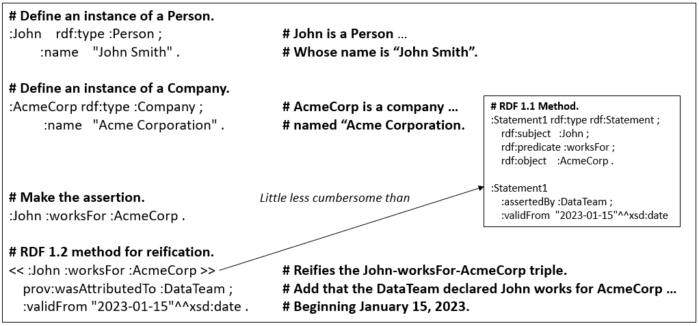
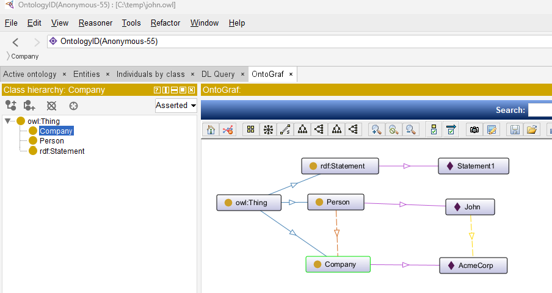

<i>This appendix accompanies [***Semantic Webs of Meaning: Building Contextual Knowledge Graphs for Deduction and Integration***](https://technicspub.com/semantic-webs-of-meaning/) by Eugene Asahara, published by [Technics Publications](https://technicspub.com).</i>

## Fix to the topic, "Reification in RDF 1.2" (August 24, 2026)

Following is a corrected version of the topic in Chapter 6: Reification in RDF 1.2. The text in the book treated `<< :John :worksFor :AcmeCorp >>` as if it both asserted the employment fact and allowed metadata to be attached. In RDF 1.2 that form only reifies the proposition; the plain triple is what asserts it.

### Corrected Text and Figure 85

#### <i>Reification in RDF 1.2 </i>

Fortunately, RDF 1.2 makes this process much easier. Instead of using the older rdf:Statement, rdf:subject, rdf:predicate, and rdf:object pattern, RDF 1.2 introduces a reified triple syntax, written as << ... >>. As illustrated in Figure 85, << :John :worksFor :AcmeCorp >> creates a reifier for the triple so that additional properties, such as who asserted it and when it became valid, can be attached to that reification. The original triple is asserted separately as :John :worksFor :AcmeCorp ., because reifying a triple does not by itself assert that the triple is true in the graph. RDF 1.2 therefore preserves the distinction between stating a fact and making statements about that fact, while making the latter far less cumbersome than RDF 1.1 reification. 

See book_code/appendix_i_reification.md for a more comprehensive discussion of reification.


<i>Figure 85 - RDF 1.2 method for reification. </i>


# Appendix G: Reification in RDF


Reification is a technique that was introduced in RDF 1.0 to allow statements to be made *about other statements*. While the core idea of RDF is that all knowledge is expressed as triples, there are situations where you need to attach additional information *to a triple itself* — such as who asserted it, when it was valid, or how confident we are in it.

Because RDF 1.1 does not allow properties to be attached directly to triples, a workaround was created. This workaround is called **reification**.

### What Reification Actually Does

Reification turns a triple into a **resource** so that other triples can describe it. It does this by creating a new resource (often given a name like `:Statement1`) that represents the original triple.

To do this, RDF uses four specific terms:

- `rdf:Statement` — A class used to indicate that a resource represents a triple.
- `rdf:subject` — Points to the subject of the original triple.
- `rdf:predicate` — Points to the predicate (property) of the original triple.
- `rdf:object` — Points to the object of the original triple.

These four terms exist specifically to describe **triples**. Reification does not apply to classes, properties, or individuals in the same way.


###  Intuition for Reification

**Reification is what you do when you want to talk *about* a fact, instead of just stating the fact.**

In normal life and in normal data modeling, we usually do this:

> We create things (people, companies, products), then we describe how they relate to each other.

But sometimes we need to go one level higher. We don’t just want to say:

> “John works for AcmeCorp.”

We want to say something *about that statement itself*, such as:

> “The claim that John works for AcmeCorp was made by the Data Team on January 15th, with 92% confidence.”

In regular RDF, you can’t attach information directly to a relationship. So reification is a workaround where you create a **new thing** whose only job is to represent the original relationship, so you can then attach information *to that new thing*.

### Better Everyday Analogies

Here are a few intuitive ways to think about it:

| Analogy                    | Intuition                                                                 | How it maps to reification |
|---------------------------|---------------------------------------------------------------------------|----------------------------|
| **Quote / Quotation marks** | You put a sentence in quotes so you can talk *about* what was said       | The reified statement is like putting the triple in “quotes” so you can describe it |
| **Receipt or Record**      | The actual event happened (John started working). You create a *record* of that event | The reified statement is the record about the employment fact |
| **Post-it Note**           | You write a fact on a whiteboard, then stick a Post-it note on it with extra info (who, when, confidence) | The Post-it note = the reification triples |
| **Audit Log**              | In a database, sometimes you don’t just change data — you also log *who changed it and when* | Reification is like an audit entry for a specific triple |

### Why It Feels Unnatural 

Here is a Python analogy;

- In Python (and in normal modeling), you **first create the thing**, then you use or describe it.
- Reification feels backwards because you have to **create a description of the relationship** before you can attach information to it.

This is why reification feels artificial to most people — it forces you to treat a *relationship* as if it were a *thing*.

Reification is a way to create a stand-in for a relationship so you can attach extra information to it — like putting a fact inside quotation marks so you can talk about the fact itself.

In many knowledge graphs, the relationship is the interesting thing—not only the two endpoints. Employment, diagnosis, ownership, lineage, and risk claims are often where provenance, time, confidence, and disagreement live. Reification exists because ordinary triples give you the endpoints, but not a handle on the edge itself. Making the relationship a first-class subject is what expands what you can say.

### Example of Reification

Suppose we have the following fact:

```turtle
:John :worksFor :AcmeCorp .
```

If we want to record that this fact was asserted by the Data Team on a specific date, we cannot attach that information directly to the triple in RDF 1.1. Instead, we must use reification:

```turtle
@prefix :    <http://example.org/> .
@prefix rdf: <http://www.w3.org/1999/02/22-rdf-syntax-ns#> .
@prefix xsd: <http://www.w3.org/2001/XMLSchema#> .

# The original fact
:John :worksFor :AcmeCorp .

# Reification: Create a resource that represents the triple above
:Statement1 rdf:type rdf:Statement ;
    rdf:subject   :John ;
    rdf:predicate :worksFor ;
    rdf:object    :AcmeCorp .

# Metadata attached to the reified statement
:Statement1 
    :assertedBy :DataTeam ;
    :validFrom "2023-01-15"^^xsd:date .
```

In this example:
- `:John :worksFor :AcmeCorp` is the actual asserted fact.
- `:Statement1` is a new resource created to *stand in for* that fact.
- The properties `rdf:subject`, `rdf:predicate`, and `rdf:object` are used to link `:Statement1` back to the original triple.
- The properties `:assertedBy` and `:validFrom` are then attached to `:Statement1`.

### Why Reification is Problematic in RDF 1.1

Reification has several well-known drawbacks:

- It is verbose. Many extra triples are required to describe a single fact.
- It is difficult to query. SPARQL queries become long and complicated.
- It is error-prone. It is easy to create inconsistent or incomplete reifications.
- It is unintuitive. Most people find the pattern confusing and unnatural.

Because of these issues, reification isn't as well-known in practice, even though it was the only standard mechanism available in RDF 1.1 for attaching metadata to individual triples.


## RDF 1.1 vs RDF 1.2

### RDF 1.1

Here is the RDF **1.1** version:

```rdf
@prefix :      <http://example.org/> .
@prefix rdf:   <http://www.w3.org/1999/02/22-rdf-syntax-ns#> .
@prefix xsd:   <http://www.w3.org/2001/XMLSchema#> .
@prefix owl: <http://www.w3.org/2002/07/owl#> .
@prefix rdfs: <http://www.w3.org/2000/01/rdf-schema#> .


# ======================
# Basic Ontology (TBox)
# ======================
:Person     rdf:type owl:Class .
:Company    rdf:type owl:Class .
:worksFor   rdf:type owl:ObjectProperty ;
            rdfs:domain :Person ;
            rdfs:range  :Company .

# ======================
# Individuals and Data (ABox)
# ======================

# Define John as an individual
:John    rdf:type :Person ;
         :name    "John Smith" .

# Define AcmeCorp
:AcmeCorp rdf:type :Company ;
          :name   "Acme Corporation" .

# ======================
# The Actual Fact (asserted)
# ======================
:John :worksFor :AcmeCorp .

# ======================
# Reification (describes the fact above)
# ======================
:Statement1 rdf:type rdf:Statement ;
    rdf:subject   :John ;
    rdf:predicate :worksFor ;
    rdf:object    :AcmeCorp .

# ======================
# Metadata about the statement
# ======================
:Statement1
    :assertedBy :DataTeam ;
    :validFrom  "2023-01-15"^^xsd:date .

```

Reification describes a triple; it does not, by itself, assert that triple. The block that links :Statement1 to :John, :worksFor, and :AcmeCorp records a proposition you can annotate. The ordinary triple :John :worksFor :AcmeCorp is what makes the employment a fact in the graph. If you omit that triple, queries and reasoners that look for who works where will not see it. RDF 1.2 annotation syntax is designed to assert and annotate in one step. Use pure reification without assertion only when you mean to talk about a claim that is not (or not yet) endorsed as true in this graph.

This is how it looks in the RDF 1.1 version using Protege:



### RDF 1.2

One terminology point matters: the current August 2026 RDF 1.2 Turtle draft calls `<< :s :p :o >>` a **reified triple** shorthand. The actual triple-term syntax is `<<( :s :p :o )>>`. RDF 1.2 also provides annotation syntax that can assert the original fact and attach metadata through a reifier in one compact statement. ([W3C][1])

### The RDF 1.2 Version

RDF 1.2 makes this considerably simpler. Instead of constructing an `rdf:Statement` and separately specifying its subject, predicate, and object, RDF 1.2 introduces a direct mechanism for identifying and describing a triple.

The same example can be written as:

```turtle
@version "1.2" .

@prefix :      <http://example.org/> .
@prefix rdf:   <http://www.w3.org/1999/02/22-rdf-syntax-ns#> .
@prefix rdfs:  <http://www.w3.org/2000/01/rdf-schema#> .
@prefix owl:   <http://www.w3.org/2002/07/owl#> .
@prefix xsd:   <http://www.w3.org/2001/XMLSchema#> .

# ======================
# Basic Ontology (TBox)
# ======================

:Person
    rdf:type owl:Class .

:Company
    rdf:type owl:Class .

:worksFor
    rdf:type owl:ObjectProperty ;
    rdfs:domain :Person ;
    rdfs:range  :Company .

# ======================
# Individuals and Data (ABox)
# ======================

# Define John as an individual.
:John
    rdf:type :Person ;
    :name "John Smith" .

# Define AcmeCorp as an individual.
:AcmeCorp
    rdf:type :Company ;
    :name "Acme Corporation" .

# ======================
# The Actual Fact (asserted)
# ======================

:John :worksFor :AcmeCorp .

# ======================
# RDF 1.2 Reification
# ======================

# :Statement1 reifies the John-worksFor-AcmeCorp triple,
# allowing metadata to be attached to that particular assertion.
<< :John :worksFor :AcmeCorp ~ :Statement1 >>
    :assertedBy :DataTeam ;
    :validFrom "2023-01-15"^^xsd:date .
```

#### Running the RDF 1.2 Example in Apache Jena Fuseki

The RDF 1.1 example can be opened in Protégé, as shown above. For the RDF 1.2 example, we will instead use **Apache Jena Fuseki**.

The examples in this repository assume Fuseki has been extracted to:

```text
C:\temp\apache-jena-fuseki-6.1.0
```

Open PowerShell and change to that directory:

```powershell
cd C:\temp\apache-jena-fuseki-6.1.0
```

Start an in-memory Fuseki dataset named `/kg`:

```powershell
.\fuseki-server.bat --mem /kg
```

The `--mem` option creates an in-memory dataset. This is convenient for tutorials because nothing needs to be configured or persisted to disk.

When Fuseki starts, open a browser and go to:

```text
http://localhost:3030
```

Select the `/kg` dataset and choose **add data**.

Upload the RDF 1.2 Turtle file containing the example above. Use [book_code/appendix_g_rdf_1_2_sample.ttl](https://github.com/MapRock/SemanticWebsOfMeaning_Private/blob/main/book_code/appendix_g_rdf_1_2_sample.ttl)

After the file has loaded, select **query**.

A simple query confirms that the original fact was asserted:

```sparql
PREFIX : <http://example.org/>

SELECT ?company
WHERE {
    :John :worksFor ?company .
}
```

The result should include:

```text
http://example.org/AcmeCorp
```

We can also query the metadata associated with the reified statement:

```sparql
VERSION "1.2"

PREFIX :   <http://example.org/>
PREFIX rdf: <http://www.w3.org/1999/02/22-rdf-syntax-ns#>

SELECT ?subject ?predicate ?object ?assertedBy ?validFrom
WHERE {
    :Statement1
        rdf:reifies ?triple ;
        :assertedBy ?assertedBy ;
        :validFrom ?validFrom .

    BIND(SUBJECT(?triple) AS ?subject)
    BIND(PREDICATE(?triple) AS ?predicate)
    BIND(OBJECT(?triple) AS ?object)
}
```

