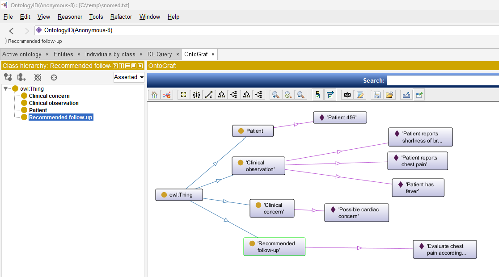

<i>This document accompanies [***Semantic Webs of Meaning: Building Contextual Knowledge Graphs for Deduction and Integration***](https://technicspub.com/semantic-webs-of-meaning/) by Eugene Asahara, published by [Technics Publications](https://technicspub.com).</i>

# Example of SNOMED in Turtle

Below is a small Turtle example showing how a local clinical knowledge graph could reference SNOMED CT concepts using standard SNOMED IRIs. Individual SNOMED CT concepts can be identified using the namespace http://snomed.info/id/, followed by the SCTID. In HL7/FHIR contexts, http://snomed.info/sct identifies the SNOMED CT code system. ([HL7 Terminology][1])



```turtle
@prefix ex:   <http://example.org/clinical/> .
@prefix sct:  <http://snomed.info/id/> .
@prefix xsd:  <http://www.w3.org/2001/XMLSchema#> .
@prefix rdfs: <http://www.w3.org/2000/01/rdf-schema#> .

#################################################################
# Local classes
#################################################################

ex:Patient
    a rdfs:Class ;
    rdfs:label "Patient" .

ex:ClinicalObservation
    a rdfs:Class ;
    rdfs:label "Clinical observation" .

ex:ClinicalConcern
    a rdfs:Class ;
    rdfs:label "Clinical concern" .

ex:RecommendedFollowUp
    a rdfs:Class ;
    rdfs:label "Recommended follow-up" .

#################################################################
# Local properties
#################################################################

ex:observedFor
    rdfs:label "observed for" .

ex:usesClinicalConcept
    rdfs:label "uses clinical concept" .

ex:observationDate
    rdfs:label "observation date" .

ex:hasObservation
    rdfs:label "has observation" .

ex:hasClinicalConcern
    rdfs:label "has clinical concern" .

ex:hasRecommendedFollowUp
    rdfs:label "has recommended follow-up" .

ex:reason
    rdfs:label "reason" .

#################################################################
# SNOMED CT concept labels used locally for readability
# The IRI is the important part; labels are local convenience.
#################################################################

sct:29857009
    rdfs:label "Chest pain" .

sct:267036007
    rdfs:label "Dyspnea / shortness of breath" .

sct:386661006
    rdfs:label "Fever" .

sct:22298006
    rdfs:label "Myocardial infarction" .

#################################################################
# Patient and observations
#################################################################

ex:Patient456
    a ex:Patient ;
    rdfs:label "Patient 456" ;
    ex:hasObservation ex:Observation001 ;
    ex:hasObservation ex:Observation002 ;
    ex:hasObservation ex:Observation003 .

ex:Observation001
    a ex:ClinicalObservation ;
    rdfs:label "Patient reports chest pain" ;
    ex:observedFor ex:Patient456 ;
    ex:usesClinicalConcept sct:29857009 ; # http://snomed.info/id/29857009
    ex:observationDate "2026-06-11"^^xsd:date .

ex:Observation002
    a ex:ClinicalObservation ;
    rdfs:label "Patient reports shortness of breath" ;
    ex:observedFor ex:Patient456 ;
    ex:usesClinicalConcept sct:267036007 ;
    ex:observationDate "2026-06-11"^^xsd:date .

ex:Observation003
    a ex:ClinicalObservation ;
    rdfs:label "Patient has fever" ;
    ex:observedFor ex:Patient456 ;
    ex:usesClinicalConcept sct:386661006 ;
    ex:observationDate "2026-06-11"^^xsd:date .

#################################################################
# Example decision-support output
# This is NOT supplied by SNOMED CT itself.
# SNOMED supplies standardized clinical concepts.
# Local clinical rules/guidelines would create these concerns.
#################################################################

ex:Concern001
    a ex:ClinicalConcern ;
    rdfs:label "Possible cardiac concern" ;
    ex:usesClinicalConcept sct:22298006 ;
    ex:reason "Chest pain and shortness of breath were observed. This does not diagnose myocardial infarction, but it may justify further clinical evaluation." ;
    ex:observedFor ex:Patient456 .

ex:FollowUp001
    a ex:RecommendedFollowUp ;
    rdfs:label "Evaluate chest pain according to local clinical protocol" ;
    ex:reason "Local decision-support rules identified chest pain with shortness of breath." ;
    ex:observedFor ex:Patient456 .

ex:Patient456
    ex:hasClinicalConcern ex:Concern001 ;
    ex:hasRecommendedFollowUp ex:FollowUp001 .
```


[1]: https://terminology.hl7.org/SNOMEDCT.html?utm_source=chatgpt.com "Using SNOMED CT with HL7 Standards"
