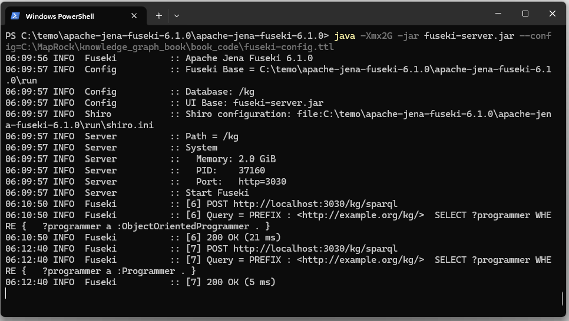

<i>This document accompanies [***Semantic Webs of Meaning: Building Contextual Knowledge Graphs for Deduction and Integration***](https://technicspub.com/semantic-webs-of-meaning/) by Eugene Asahara, published by [Technics Publications](https://technicspub.com).</i>

# Running Fuseki 6.1.0 with a Jena Rule Reasoner

This example shows how to run Apache Jena Fuseki with a small knowledge graph and a custom inference rule.

The goal is to show this pattern:

```text
facts + rules = inferred facts
```

In the base RDF data, we may know that:

```text
Eugene is a Programmer.
Eugene knows Python.
Python is an ObjectOrientedLanguage.
```

But the data does not need to explicitly say:

```text
Eugene is an ObjectOrientedProgrammer.
```

Instead, Jena can infer that from a rule.

The rule is:

```text
If a person is a Programmer,
and that person knows a language,
and that language is an ObjectOrientedLanguage,
then that person is an ObjectOrientedProgrammer.
```

This is a simple example, but it demonstrates the larger idea behind rule-based reasoning in a dge graph.

---

# 1. Files Used in This Example

This example uses two main files:


- [programmers.ttl](https://github.com/MapRock/SemanticWebsOfMeaning_Private/blob/main/book_code/programmers.ttl)
- [fuseki-config.ttl](https://github.com/MapRock/SemanticWebsOfMeaning_Private/blob/main/book_code/fuseki-config.ttl)


The file `programmers.ttl` contains the RDF data.

The file `fuseki-config.ttl` tells Fuseki how to load that RDF data, expose it as a SPARQL endpoint, and apply the Jena rule reasoner.

The important point is that the rule is not just querying existing data. It creates inferred triples that SPARQL can then query.

---

# 2. What `programmers.ttl` Does

The file `programmers.ttl` defines a small dge graph.

It includes classes such as:

```text
Programmer
ObjectOrientedProgrammer
ProgrammingLanguage
ObjectOrientedLanguage
```

It includes properties such as:

```text
knowsLanguage
hasExpertise
worksFor
yearsExperience
```

It also includes individuals such as:

```text
Eugene
Anna
Ben
CSharp
Python
JavaScript
SQL
```

The important facts are:

```text
Eugene is a Programmer.
Anna is a Programmer.
Ben is a Programmer.

Eugene knows CSharp, Python, and SQL.
Anna knows Python and JavaScript.
Ben knows SQL.

CSharp, Python, and JavaScript are ObjectOrientedLanguage.
SQL is only a ProgrammingLanguage.
```

Therefore, Eugene and Anna should be inferred to be `ObjectOrientedProgrammer`.

Ben should not, because in this example SQL is not classified as an object-oriented language.

---

# 3. What `fuseki-config.ttl` Does

The file `fuseki-config.ttl` is the Fuseki server configuration.

It defines the dataset Fuseki will expose and how that dataset is built.

The configuration has this basic structure:

```text
Fuseki Service
    -> RDF Dataset
        -> Default Graph
            -> Inference Model
                -> Base Model
                    -> programmers.ttl
                -> GenericRuleReasoner
                    -> custom rule
```

The most important point is that Fuseki must serve the **inference model**, not the raw Turtle file directly.

The critical pattern is:

```turtle
:dataset rdf:type ja:RDFDataset ;
    ja:defaultGraph :model .
```

Here, `:model` is the `ja:InfModel`.

That means SPARQL queries run against the graph after inference has been applied.

The wrong pattern would be this:

```turtle
:dataset rdf:type ja:RDFDataset ;
    ja:defaultGraph :baseModel .
```

or this:

```turtle
:dataset rdf:type ja:RDFDataset ;
    ja:defaultGraph :graph .
```

Those patterns expose the raw graph only. The data will load, but inferred triples will not appear.

---

# 4. What the Rule Does

The custom rule says:

```text
Programmer
+ knowsLanguage
+ ObjectOrientedLanguage
= ObjectOrientedProgrammer
```

In plain English:

```text
If ?p is a Programmer,
and ?p knows language ?l,
and ?l is an ObjectOrientedLanguage,
then infer that ?p is an ObjectOrientedProgrammer.
```

The working version uses full IRIs inside the rule rather than prefixes. This is more verbose, but it avoids rule-parser problems with prefixes.

So the rule logic is equivalent to this:

```text
?p rdf:type kg:Programmer
?p kg:knowsLanguage ?l
?l rdf:type kg:ObjectOrientedLanguage

therefore

?p rdf:type kg:ObjectOrientedProgrammer
```

This is the triple that Jena will infer:

```text
Eugene rdf:type ObjectOrientedProgrammer
Anna rdf:type ObjectOrientedProgrammer
```

---

# 5. Starting Fuseki

See [install_jena_fuseki.md](https://github.com/MapRock/SemanticWebsOfMeaning_Private/blob/main/install_jena_fuseki.md) to install Jena Fuseki.

If a Fuseki instance is already running, focus on the Powershell window it's in and ctrl-C to exit it.

Open PowerShell and move to the Fuseki folder:

```powershell
cd C:/apache-jena-fuseki-6.1.0
```

Start Fuseki with the config file:

```powershell
java -Xmx2G -jar fuseki-server.jar --config=C:\MapRock\SemanticWebsOfMeaning\book_code\fuseki-config.ttl
```

If Fuseki starts correctly, it should show that the dataset path is:

```text
/kg
```


The Fuseki web interface should be available at:

```text
http://localhost:3030
```

The SPARQL endpoint is:

```text
http://localhost:3030/kg/sparql
```


*Figure 1 – Starting Jena Fuseki in PowerShell.

---

# 6. Query 1: Confirm the Base Data Loaded

Before testing inference, first confirm that the base RDF data loaded.

Run this SPARQL query:

```sparql
PREFIX : <http://example.org/kg/>

SELECT ?programmer
WHERE {
  ?programmer a :Programmer .
}
```

Expected results:

```text
http://example.org/kg/Eugene
http://example.org/kg/Anna
http://example.org/kg/Ben
```

This proves Fuseki loaded the Turtle file.

---

# 7. Query 2: Confirm the Rule Condition Matches

Next, test whether the data satisfies the condition side of the rule.

Run:

```sparql
PREFIX : <http://example.org/kg/>

SELECT ?programmer ?language
WHERE {
  ?programmer a :Programmer .
  ?programmer :knowsLanguage ?language .
  ?language a :ObjectOrientedLanguage .
}
```

Expected results include:

```text
Eugene    CSharp
Eugene    Python
Anna      Python
Anna      JavaScript
```

This proves the graph contains programmers who know object-oriented languages.

At this point, the data is ready for the inference rule.

---

# 8. Query 3: Query the Inferred Class

Now query the inferred class:

```sparql
PREFIX : <http://example.org/kg/>

SELECT ?programmer
WHERE {
  ?programmer a :ObjectOrientedProgrammer .
}
```

Expected results:

```text
http://example.org/kg/Eugene
http://example.org/kg/Anna
```

This is the important result.

The original RDF data does not need to explicitly say that Eugene and Anna are `ObjectOrientedProgrammer`.

Jena infers that because:

```text
Eugene is a Programmer.
Eugene knows Python.
Python is an ObjectOrientedLanguage.
```

and:

```text
Anna is a Programmer.
Anna knows JavaScript.
JavaScript is an ObjectOrientedLanguage.
```

---

# 9. Why Ben Does Not Appear

Ben is a programmer, but Ben only knows SQL.

In this example, SQL is typed as:

```text
ProgrammingLanguage
```

but not as:

```text
ObjectOrientedLanguage
```

Therefore, Ben does not satisfy the full rule condition.

The rule requires:

```text
Programmer + knows ObjectOrientedLanguage
```

Ben only satisfies:

```text
Programmer + knows ProgrammingLanguage
```

So Ben is not inferred to be an `ObjectOrientedProgrammer`.

---

# 10. Common Error: Port 3030 Already in Use

If Fuseki fails with this message:

```text
Failed to bind port 3030 - another Fuseki running on this machine?
```

then another Fuseki or Java process is already running on port `3030`.

Run:

```powershell
netstat -ano | findstr :3030
```

Look for a line with `LISTENING`.

The last number on that line is the process ID.

For example:

```text
TCP    0.0.0.0:3030    0.0.0.0:0    LISTENING    1264
```

Then kill that process:

```powershell
taskkill /PID 1264 /F
```

Replace `1264` with the process ID from your machine.

Then restart Fuseki:

```powershell
java -Xmx2G -jar fuseki-server.jar --config=fuseki-config.ttl
```

---

# 11. Common Error: Data Loads but Inference Returns Nothing

A common failure pattern is:

```sparql
SELECT ?programmer
WHERE {
  ?programmer a :Programmer .
}
```

returns results, but:

```sparql
SELECT ?programmer
WHERE {
  ?programmer a :ObjectOrientedProgrammer .
}
```

returns nothing.

That usually means the base data loaded, but the inference model is not being served.

Check the Fuseki config.

This is the key line:

```turtle
:dataset rdf:type ja:RDFDataset ;
    ja:defaultGraph :model .
```

The default graph must be the inference model.

If the default graph points directly to the raw graph or base model, then SPARQL will only see the original triples.

---

# 12. What This Example Demonstrates

This example shows how a knowledge graph can combine explicit facts with rules.

The Turtle file stores facts.

The Jena rule expresses logic.

Fuseki exposes the result through SPARQL.

The result is not just data retrieval. It is basic reasoning:

```text
Stored facts:
    Eugene is a Programmer.
    Eugene knows Python.
    Python is an ObjectOrientedLanguage.

Rule:
    Programmers who know object-oriented languages are ObjectOrientedProgrammers.

Inferred fact:
    Eugene is an ObjectOrientedProgrammer.
```

That is the central value of rule-based inference in a knowledge graph.
