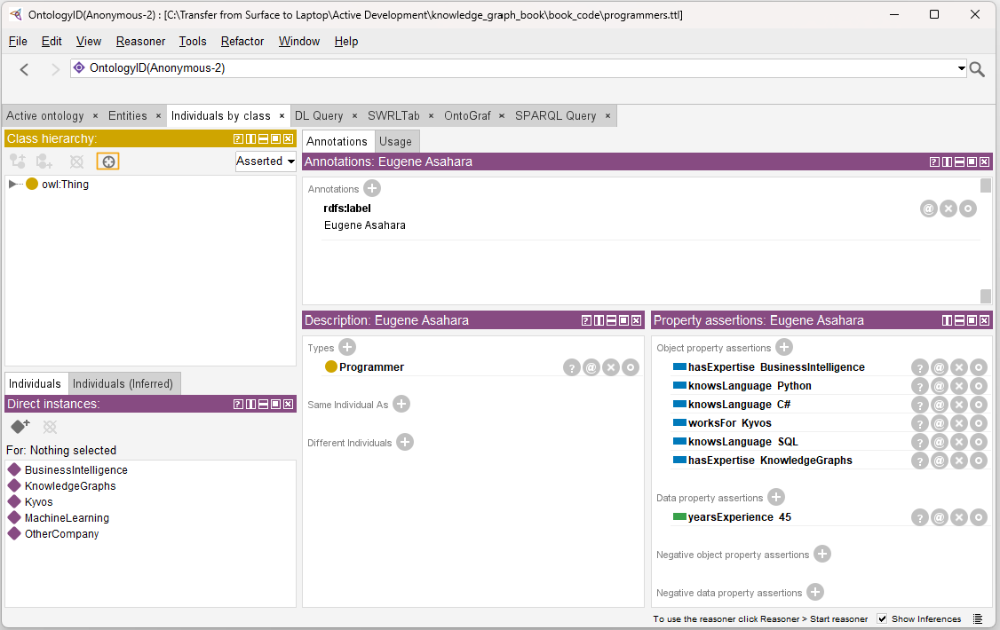
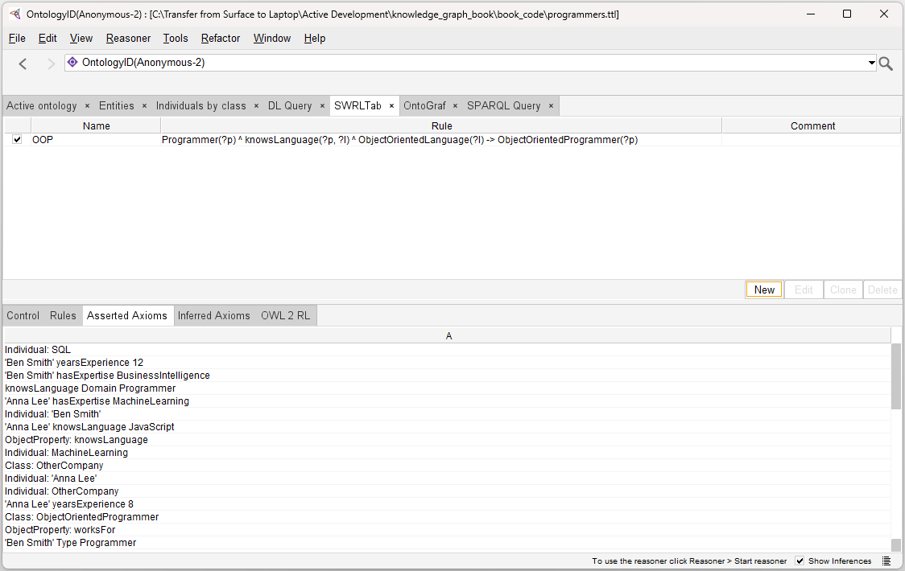
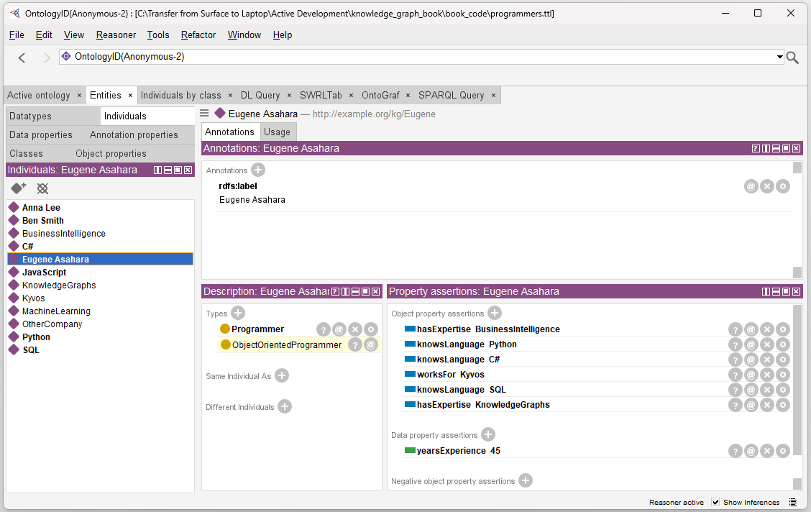

<i>This document accompanies [***Semantic Webs of Meaning: Building Contextual Knowledge Graphs for Deduction and Integration***](https://technicspub.com/semantic-webs-of-meaning/) by Eugene Asahara, published by [Technics Publications](https://technicspub.com).</i>

# Exercise: Adding a SWRL Rule and Observing Inferences in Protégé

**Goal**: Learn how to configure Protégé’s reasoner, add a SWRL rule, and observe how the reasoner infers new class membership.

---

## Learning Objectives

By the end of this exercise you will be able to:

- Configure Pellet as the reasoner in Protégé
- Open an existing ontology file
- Add a simple SWRL rule
- Distinguish between asserted and inferred information
- Observe SWRL-driven inferences in the Individuals view

---

## Prerequisites

- Protégé installed (see the separate [installation guide](https://github.com/MapRock/SemanticWebsOfMeaning/blob/main/install_stanford_protege.md))
- Basic familiarity with opening files in Protégé
- The file [book_code/programmers.ttl](https://github.com/MapRock/SemanticWebsOfMeaning/blob/main/book_code/programmers.ttl) from the repository

---

## Step 1: Open Protégé and Configure the Reasoner

1. Open **Protégé**.
2. Go to the menu: **Reasoner → Configure**.
3. In the configuration window:
   - Select **Pellet** as the reasoner (recommended for SWRL support).
   - Make sure **SWRL rules**, **Classify taxonomy**, and **Realize instances** are checked.
4. Click **OK**.

Now ensure the SWRL tab is opened.

1. On the main menu, select Windows->Tabs, and ensure "SWRL Tab" is checked.


---

## Step 2: Open the Ontology File

1. Go to **File → Open**.
2. Navigate to the repository folder and open:
   ```
   https://github.com/MapRock/SemanticWebsOfMeaning/blob/main/book_code/programmers.ttl
   ```
3. Once loaded, you should see the **Programmer** class and the three individuals: **Eugene**, **Anna**, and **Ben**.


---

## Step 3: Explore the Current Ontology

Before adding any rules, explore the ontology:

1. Go to the **Individuals by class** tab.
2. Expand **Programmer**.
3. Note that there is **no class** called `ObjectOrientedProgrammer`.
4. Also check the **Entities** tab — confirm that `ObjectOrientedProgrammer` and `ObjectOrientedLanguage` do not exist yet (they will be inferred later).



*Figure 1 – The ontology before reasoning. Note that `ObjectOrientedProgrammer` does not exist yet.*

**Observation**: At this point, the ontology only contains asserted facts. No inferences have been made.

---

## Step 4: Add the SWRL Rule

1. Click on the **SWRLTab** tab (usually at the top).
2. Click the **New** button to create a new rule.
3. Name the rule something meaningful, e.g. `OOP` (for Object-Oriented Programmer).
4. Enter the following rule in the rule editor:

```swrl
Programmer(?p) ^ knowsLanguage(?p, ?l) ^ ObjectOrientedLanguage(?l) 
-> ObjectOrientedProgrammer(?p)
```


*Figure 3 – The ontology before reasoning. Note that `ObjectOrientedProgrammer` does not exist yet.*


5. Click **OK** to save the rule.

---


## Step 5: Run the Reasoner and Observe Inferences

1. Go to the menu and select **Reasoner → Start reasoner** (or **Synchronize reasoner** if it’s already running).
2. Wait for the reasoner to finish.
3. Go to the **Individuals by class** tab again.
4. Expand the class hierarchy and look for **ObjectOrientedProgrammer**.

You should now see **Eugene** and **Anna** listed under `ObjectOrientedProgrammer`.



*Figure 5 – The ontology before reasoning. Note that `ObjectOrientedProgrammer` does not exist yet.*
**Congratulations!** You have successfully used a SWRL rule to infer new class membership.

---

### Expected Result

- **Before reasoning**: Only asserted facts are visible. `ObjectOrientedProgrammer` does not exist.
- **After reasoning with Pellet**: The reasoner infers that Eugene and Anna are instances of `ObjectOrientedProgrammer` because they know at least one `ObjectOrientedLanguage`.

---

## 6. Saving the SWRL Rule (Optional but Recommended)

After you have successfully added the SWRL rule and seen the inferences, you have two choices:

### Option A: Save the Ontology with the SWRL Rule

If you want to keep the SWRL rule as part of the ontology:

1. Go to **File → Save** (or **File → Save As**).
2. Navigate to your `book_code` folder.
3. Save the file with the name:

   ```
   programmers_with_oop.ttl
   ```

4. Click **Save**.

Protégé will now include the SWRL rule inside the ontology file. 

When you save the ontology, the SWRL rule is no longer stored in the readable syntax you typed in the SWRL tab, `(Programmer(?p) ^ knowsLanguage(?p, ?l) ...)`.

Instead, the rule becomes part of the knowledge graph itself. It is converted into the ontology’s native representation (using the SWRL vocabulary and OWL axioms). This means the rule is now a formal, persistent part of the knowledge graph rather than a separate rule sitting on top of it.

You can verify this by opening programmers_with_oop.ttl in a text editor (VS Code, Notepad++, etc.). If you scroll to the bottom of the file, you will see the rule stored as a set of triples rather than in the clean SWRL syntax you originally entered. 

### Option B: Close Without Saving the SWRL Rule

If you only wanted to experiment and do **not** want to keep the SWRL rule:

1. Close Protégé (or close the current ontology tab).
2. When prompted **“Save changes to the ontology?”**, choose **Don’t Save**.

This will discard the SWRL rule you added, and the original `programmers.ttl` file will remain unchanged.

---

### Why This Matters

- SWRL rules are **not** stored separately — they become part of the ontology file when you save.
- Saving the file as `programmers_with_oop.ttl` creates a new version of the ontology that includes both the original data **and** the rule.
- This is useful when you want to share the ontology with the rule included, or continue working on it later.

---

## Reflection Questions

1. Why didn’t `ObjectOrientedProgrammer` appear before running the reasoner?
2. What role does the SWRL rule play in this inference?
3. Why is Pellet generally preferred over HermiT when working with SWRL rules?
4. How might this pattern be useful when modeling real-world knowledge (e.g., skills, certifications, or risk profiles)?

---

## Next Steps

- Try modifying the rule or adding new individuals and languages.
- Experiment with making `ObjectOrientedProgrammer` a subclass of `Programmer` using OWL instead of (or in addition to) SWRL.
- Explore how inferred axioms appear in the **Inferred Axioms** tab inside the SWRLTab.


