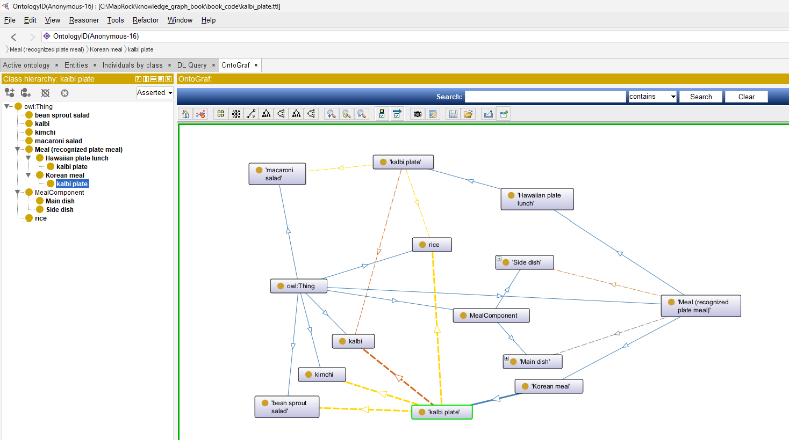

# Quick Summary of the Ontology

This document lists a few interesting queries for [kalbi_plate.ttl](https://github.com/MapRock/knowledge_graph_book/blob/main/book_code/kalbi_plate.ttl), which is mentioned on page 18 of the book.



This is a small ontology that models **two culturally different versions** of a "Kalbi Plate":

| Concept                    | Hawaiian Version                  | Korean Version                          | Key Difference |
|---------------------------|-----------------------------------|-----------------------------------------|----------------|
| **Class**                 | `HawaiianKalbiPlate`              | `KoreanKalbiPlate`                      | Same name, different meaning |
| **Main Dish**             | Must have `Kalbi` and rice        | Must have `Kalbi` and rice              | Same |
| **Side Dishes**           | Macaroni Salad             | Kimchi + Bean Sprout Salad       | Very different |
| **Parent Class**          | `HawaiianPlateLunch`              | `KoreanMeal`                            | Different cultural categories |

**OWL restrictions** are used to define exactly what each version *must* contain.

---

## Interesting SPARQL Queries

Here are some good queries, ordered from simple to more insightful. Use [Jena Fuseki](https://github.com/MapRock/SemanticWebsOfMeaning/blob/main/install_jena_fuseki.md) for this querying.

### 1. Show Both Versions of "Kalbi Plate" (Most Interesting)

```sparql
PREFIX : <http://example.org/foodkg#>
PREFIX rdfs: <http://www.w3.org/2000/01/rdf-schema#>

SELECT ?version ?label ?parent ?parentLabel
WHERE {
  ?version rdfs:subClassOf* :Meal ;
           rdfs:label ?label ;
           rdfs:subClassOf ?parent .

  FILTER(?label = "kalbi plate")

  ?parent rdfs:label ?parentLabel .
}
```

**What it shows**: Both `HawaiianKalbiPlate` and `KoreanKalbiPlate` have the same label but belong to different parent classes.

### 2. What Side Dishes Does Each Version Require?

```sparql
PREFIX : <http://example.org/foodkg#>
PREFIX rdf:  <http://www.w3.org/1999/02/22-rdf-syntax-ns#>
PREFIX rdfs: <http://www.w3.org/2000/01/rdf-schema#>
PREFIX owl: <http://www.w3.org/2002/07/owl#>

SELECT ?plate ?sideDishLabel
WHERE {
  ?plate rdfs:label "kalbi plate" ;
         rdfs:subClassOf [
           rdf:type owl:Restriction ;
           owl:onProperty :hasSideDish ;
           owl:someValuesFrom ?sideDish
         ] .
  ?sideDish rdfs:label ?sideDishLabel .
}
ORDER BY ?plate
```


### 3. Compare Hawaiian vs Korean Kalbi Plate Side-by-Side

```sparql
PREFIX : <http://example.org/foodkg#>
PREFIX rdf:  <http://www.w3.org/1999/02/22-rdf-syntax-ns#>
PREFIX rdfs: <http://www.w3.org/2000/01/rdf-schema#>
PREFIX owl:  <http://www.w3.org/2002/07/owl#>

SELECT ?version ?componentType ?dishLabel
WHERE {
  VALUES ?version {
      :HawaiianKalbiPlate
      :KoreanKalbiPlate
  }

  ?version rdfs:subClassOf ?restriction .

  ?restriction
      rdf:type owl:Restriction ;
      owl:onProperty ?property ;
      owl:someValuesFrom ?dish .

  VALUES (?property ?componentType) {
      (:hasMainDish "Main Dish")
      (:hasSideDish "Side Dish")
  }

  ?dish rdfs:label ?dishLabel .
}
ORDER BY ?version ?componentType ?dishLabel
```

### 4. Which Version Requires Kimchi?

```sparql
PREFIX :    <http://example.org/foodkg#>
PREFIX rdfs: <http://www.w3.org/2000/01/rdf-schema#>
PREFIX owl:  <http://www.w3.org/2002/07/owl#>

SELECT ?plate
WHERE {
  ?plate
      rdfs:subClassOf [
          a owl:Restriction ;
          owl:onProperty :hasSideDish ;
          owl:someValuesFrom :Kimchi
      ] .
}
```


### 5. Find All Possible Main Dishes for Korean Meals

```sparql
PREFIX : <http://example.org/foodkg#>
PREFIX rdfs: <http://www.w3.org/2000/01/rdf-schema#>
PREFIX owl:  <http://www.w3.org/2002/07/owl#>

SELECT DISTINCT ?mainDish ?label
WHERE {
  ?meal rdfs:subClassOf* :KoreanMeal ;
        rdfs:subClassOf ?restriction .

  ?restriction
      a owl:Restriction ;
      owl:onProperty :hasMainDish ;
      owl:someValuesFrom ?mainDish .

  ?mainDish rdfs:label ?label .
}
```

### 6. What Makes a "Kalbi Plate" Different Culturally?

This conceptual query highlights the value of the ontology:

```sparql
PREFIX : <http://example.org/foodkg#>
PREFIX rdfs: <http://www.w3.org/2000/01/rdf-schema#>
PREFIX owl:  <http://www.w3.org/2002/07/owl#>

SELECT ?culturalStyle ?requiredSide
WHERE {
  ?plate
      rdfs:label "kalbi plate" ;
      rdfs:subClassOf ?parent ;
      rdfs:subClassOf ?restriction .

  ?parent rdfs:label ?culturalStyle .

  ?restriction
      a owl:Restriction ;
      owl:onProperty :hasSideDish ;
      owl:someValuesFrom ?side .

  ?side rdfs:label ?requiredSide .
}
ORDER BY ?culturalStyle ?requiredSide
```


