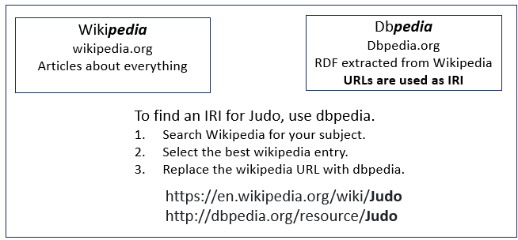

# Wikipedia and DBpedia

Wikipedia and DBpedia describe much of the same world, but they encode it differently.

**Wikipedia is written primarily for people.** A Wikipedia page such as *Judo* contains prose, headings, links, citations, an infobox, categories, images, and other material intended to explain judo to a human reader.

**DBpedia extracts structured information from Wikipedia and republishes it as an RDF knowledge graph.** In particular, it extracts information such as page identity, labels, links, categories, types, and facts from infoboxes. DBpedia's mapping system also translates many Wikipedia infobox fields into a cleaner shared ontology. ([DBpedia][1])

The figure below illustrates this with Judo as an example:



The Wikipedia URL identifies a **Web page about judo**. The DBpedia resource IRI identifies the **thing being described—Judo—in the DBpedia knowledge graph**. DBpedia deliberately derives its English resource names from English Wikipedia page titles, so the correspondence is often visually obvious. ([DBpedia][2])

That DBpedia resource can then participate in RDF statements such as:

```turtle
dbr:Judo
    rdf:type dbo:MartialArt ;
    rdfs:label "Judo"@en ;
    dbo:wikiPageWikiLink dbr:Jujutsu .
```

The exact triples available will depend on the current DBpedia extraction, but that's the basic pattern.

DBpedia therefore gives us a way to move from **reading about something** to **addressing that thing with an IRI and querying its relationships**.

This also explains the two property namespaces you commonly encounter. Properties beginning with `dbo:` come from the **DBpedia Ontology**, where Wikipedia infobox fields have been mapped into a more consistent semantic vocabulary. Properties beginning with `dbp:` are much closer to the original Wikipedia infobox fields and consequently tend to be less normalized. DBpedia itself describes the mapped ontology data as cleaner and better structured than the generically extracted infobox data. ([DBpedia][1])

For example, Wikipedia might contain an infobox field that a person sees as:

```text
Founder: Jigoro Kano
```

DBpedia can turn information of that kind into a machine-addressable relationship between resources rather than leaving it as text on a page.

Another important Linked Data feature is that the DBpedia resource IRI is **dereferenceable**. If software requests:

```text
http://dbpedia.org/resource/Judo
```

DBpedia can return RDF, while a normal browser can be directed to an HTML representation. The `/resource/` URI is the identifier; `/page/` and `/data/` are representations intended for humans or particular RDF formats. ([DBpedia][2])

So a useful mental model is:


## And Where Does Wikidata Fit?

Wiki**pedia**, **DBpedia**, and **Wikidata** are easy to confuse because all three contain information about many of the same things and look like random combinations of the same syllables.

They have different roles:

| Resource      | What it is                                                                                                 |
| ------------- | ---------------------------------------------------------------------------------------------------------- |
| **Wikipedia** | Encyclopedia articles written primarily for humans                                                         |
| **DBpedia**   | RDF knowledge graph derived substantially from Wikipedia pages, infoboxes, links, categories, and mappings |
| **Wikidata**  | Collaboratively maintained structured knowledge base whose entities have identifiers such as `Q11420`      |


DBpedia can link its resource for Judo to corresponding identifiers in other knowledge bases through relationships such as `owl:sameAs`:

```turtle
@prefix dbr:  <http://dbpedia.org/resource/> .
@prefix wd:   <http://www.wikidata.org/entity/> .
@prefix owl:  <http://www.w3.org/2002/07/owl#> .

dbr:Judo
    owl:sameAs wd:Q11420 .
```
```turtle
@prefix wd:     <http://www.wikidata.org/entity/> .
@prefix schema: <https://schema.org/> .

wd:Q11420
    schema:mainEntityOfPage
        <https://en.wikipedia.org/wiki/Judo> .
```
---

## Three ways, in the order most people actually use.

### 1. Follow a page

Pick a Wiki**pedia** title and change the host:

```text
https://en.wikipedia.org/wiki/Judo
https://dbpedia.org/page/Judo
```

`/page/` is the human view. The identifier is:

```text
http://dbpedia.org/resource/Judo
```

From a resource you can ask for Turtle:

```bash
curl -L -H "Accept: text/turtle" http://dbpedia.org/resource/Judo
```

Or open:

```text
https://dbpedia.org/data/Judo.ttl
```

Types and properties on that page (`rdf:type`, `dbo:`, `dbp:`) are the ontology you will reuse.

### 2. Search, then open the resource

- [DBpedia Lookup](https://lookup.dbpedia.org/) — type a label, get candidate IRIs  
- Or the main site search on [dbpedia.org](https://www.dbpedia.org/)

Use Lookup when the English Wikipedia title is not obvious (`Brazilian_jiu-jitsu` vs `Brazilian_Jiu-Jitsu`).

### 3. SPARQL when you already have a question

Endpoint: [https://dbpedia.org/sparql](https://dbpedia.org/sparql)

```sparql
PREFIX dbr: <http://dbpedia.org/resource/>
PREFIX dbo: <http://dbpedia.org/ontology/>
PREFIX rdfs: <http://www.w3.org/2000/01/rdf-schema#>

SELECT ?p ?o
WHERE {
  dbr:Judo ?p ?o
}
LIMIT 50
```

Find a thing by label:

```sparql
PREFIX rdfs: <http://www.w3.org/2000/01/rdf-schema#>

SELECT ?s
WHERE {
  ?s rdfs:label "Brazilian jiu-jitsu"@en
}
```

What class is it:

```sparql
PREFIX dbr: <http://dbpedia.org/resource/>
PREFIX rdf:  <http://www.w3.org/1999/02/22-rdf-syntax-ns#>

SELECT ?type
WHERE { dbr:Judo rdf:type ?type }
```

### How to read what you find

| Prefix | Meaning |
|---|---|
| `dbr:` | the thing |
| `dbo:` | mapped ontology (cleaner) |
| `dbp:` | raw infobox properties (messy, useful) |
| `rdf:type` / `dbo:` classes | what DBpedia thinks it is |
| `owl:sameAs` | links to Wikidata, other language chapters |

Prefer `dbo:` in your own graph. Use `dbp:` only when the mapped property does not exist.

### For the Jiu-Jitsu/Judo Example

Related to the article, [Judo, Jujitsu, and BJJ](https://github.com/MapRock/SemanticWebsOfMeaning/blob/main/docs/jujitsu_judo_bjj_lineage_semantics_lesson.md), start here:

- [Judo](https://dbpedia.org/page/Judo) → `dbr:Judo`  
- [Brazilian_jiu-jitsu](https://dbpedia.org/page/Brazilian_jiu-jitsu)  
- [Jujutsu](https://dbpedia.org/page/Jujutsu)  
- [Aikido](https://dbpedia.org/page/Aikido)

Check `owl:sameAs` on each page. That is how you see whether DBpedia already splits the names you were treating as one string.

Wiki**data** is often cleaner for identity (`wd:Q11420` for judo). DBpedia is better when you want Wiki**pedia**-shaped text and infobox facts next to the IRI.


[1]: https://www.dbpedia.org/resources/ontology/ "Ontology (DBO) - DBpedia Association"
[2]: https://www.dbpedia.org/resources/linked-data/ "Linked Data Access - DBpedia Association"
