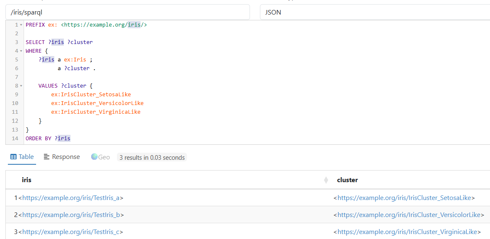
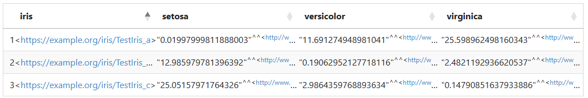

# Jena Rules Exercise with iris_rdf.rdf

This exercise uses Apache Jena Rules rather than a SWRL execution engine. The rules reproduce the nearest-centroid logic of the trained Iris K-Means model. Apache Jena Fuseki loads the RDF model and test observation, applies the Jena rule reasoner, and exposes the inferred classification through SPARQL.

## Setting Up Jena Fuseki

Copy these files into the <i>apache-jena-fuseki-6.x.x</i> directory with these three additional files. See [install_jena_fuseki.md](https://github.com/MapRock/SemanticWebsOfMeaning/blob/main/install_jena_fuseki.md), follow [steps 1](https://github.com/MapRock/SemanticWebsOfMeaning/blob/main/install_jena_fuseki.md#1-install-java-first) and 2.

| File                | Brief description                                                                                                                                                                              |
| ------------------- | ---------------------------------------------------------------------------------------------------------------------------------------------------------------------------------------------- |
| [`iris_rdf.rdf`](https://github.com/MapRock/SemanticWebsOfMeaning/blob/main/book_code/iris_rdf.rdf)      | The semantic description of the trained Iris K-Means model. It defines the model, learned cluster classes, cluster-result individuals, centroids, provenance, and related ontology terms.      |
| [`iris-test.ttl`](https://github.com/MapRock/SemanticWebsOfMeaning/blob/main/docs/iris_swrl_exercise/iris-test.ttl)     | A small test input containing a new Iris individual with sepal and petal measurements to classify.                                                                                             |
| [`iris-kmeans.rules`](https://github.com/MapRock/SemanticWebsOfMeaning/blob/main/docs/iris_swrl_exercise/iris-kmeans.rules) | Jena rules that reproduce the K-Means nearest-centroid logic by calculating the distance from the test Iris to each learned centroid and inferring the closest cluster class.                  |
| [`iris-fuseki.ttl`](https://github.com/MapRock/SemanticWebsOfMeaning/blob/main/docs/iris_swrl_exercise/iris-fuseki.ttl)   | The Fuseki/Jena assembler configuration that loads the RDF model and test data, attaches the Jena rule reasoner, and exposes the resulting inferred graph through the `/iris` SPARQL endpoint. |


This is the standard Jena assembler pattern: an InfModel wraps a base model and uses a GenericRuleReasoner whose rules are loaded with ja:rulesFrom.

## How the Jena Rules Implement the Model

Peruse the iris ML model adapted as Jena Rules: [iris-kmeans.rules](https://github.com/MapRock/SemanticWebsOfMeaning/blob/main/docs/iris_rules_exercise/iris-kmeans.rules)

The rules look more complicated than the idea behind them. Start with the Versicolor-like cluster. The k-means model learned that the center, or centroid, of this cluster has a sepal length of about 5.90, a sepal width of 2.75, a petal length of 4.39, and a petal width of 1.43. Those four numbers are embedded in the `versicolorDistance` rule. 

The rule begins by finding an individual that is an `Iris` and reading its four measurements. Think of `?i` as “the Iris we are currently trying to classify,” while `?sl`, `?sw`, `?pl`, and `?pw` stand for its sepal length, sepal width, petal length, and petal width. The rule then compares each of those measurements with the corresponding Versicolor centroid value. It subtracts one from the other, squares the difference, and adds the four squared differences together. The resulting number is stored as that Iris individual’s `distanceToVersicolorCentroid`. 

For example, this part:

```text
difference(?sl, 5.9016129, ?d1)
product(?d1, ?d1, ?d1sq)
```

essentially means: “How far is this flower’s sepal length from 5.9016129? Now square that difference.” The rule does the same thing for the other three measurements and adds the results together. A smaller number means the flower is more similar to the center of the Versicolor-like cluster. The square root normally used for Euclidean distance is unnecessary here because we only care which distance is smallest; taking the square root would not change their ordering.

The next two rules do exactly the same calculation for the Setosa-like and Virginica-like centroids. The Setosa-like centroid is approximately `(5.006, 3.428, 1.462, 0.246)`, while the Virginica-like centroid is approximately `(6.85, 3.074, 5.742, 2.071)`. After these rules have run, every Iris being classified has three calculated values: its distance from the Versicolor-like centroid, its distance from the Setosa-like centroid, and its distance from the Virginica-like centroid. 

The final three rules make the selection. `classifyVersicolor`, for example, says that if the Versicolor distance is less than or equal to both the Setosa and Virginica distances, then assert that the Iris is an instance of `IrisCluster_VersicolorLike`. The Setosa and Virginica rules perform the corresponding comparisons for their clusters. In other words, **calculate three distances and choose the nearest centroid**. That is the essential decision made by the original k-means model, now expressed as rules that Jena can execute against RDF data. 

Please note that the comparison operators are deliberately slightly asymmetric: some use “less than or equal to,” while others use strict “less than”. That provides a deterministic answer in the unlikely case that an observation is exactly the same distance from two centroids; the rules break the tie according to the model’s cluster-number order. 


## Starting Up Jena Fuseki

Using PowerShell, navigate to that directory:
```text
cd C:\temp\apache-jena-fuseki-6.1.0
```

Start Fuseki:

```bat
.\fuseki-server.bat --conf=iris-fuseki.ttl
```
## Opening Jena and Running the Rules

Then open the Fuseki UI and select the iris dataset, or query the endpoint at:

```bat
http://localhost:3030/iris/sparql
```
Fuseki supports assembler configuration files exactly this way.

Run this SPARQL:

```sparql
PREFIX ex: <https://example.org/iris/>

SELECT ?iris ?cluster
WHERE {
    ?iris a ex:Iris ;
          a ?cluster .

    VALUES ?cluster {
        ex:IrisCluster_SetosaLike
        ex:IrisCluster_VersicolorLike
        ex:IrisCluster_VirginicaLike
    }
}
ORDER BY ?iris
```

You should get:




For debugging, this query is also useful:

```sparql
PREFIX ex: <https://example.org/iris/>

SELECT ?iris ?setosa ?versicolor ?virginica
WHERE {
    ?iris
        ex:distanceToSetosaCentroid ?setosa ;
        ex:distanceToVersicolorCentroid ?versicolor ;
        ex:distanceToVirginicaCentroid ?virginica .
}
ORDER BY ?iris
```

With the test values above, you should see squared distances approximately:



So you can visually verify that Versicolor is the nearest centroid before even checking the inferred class.
