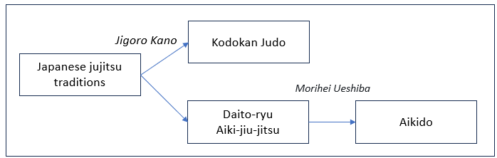
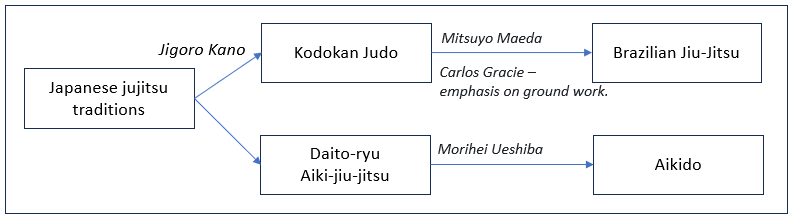
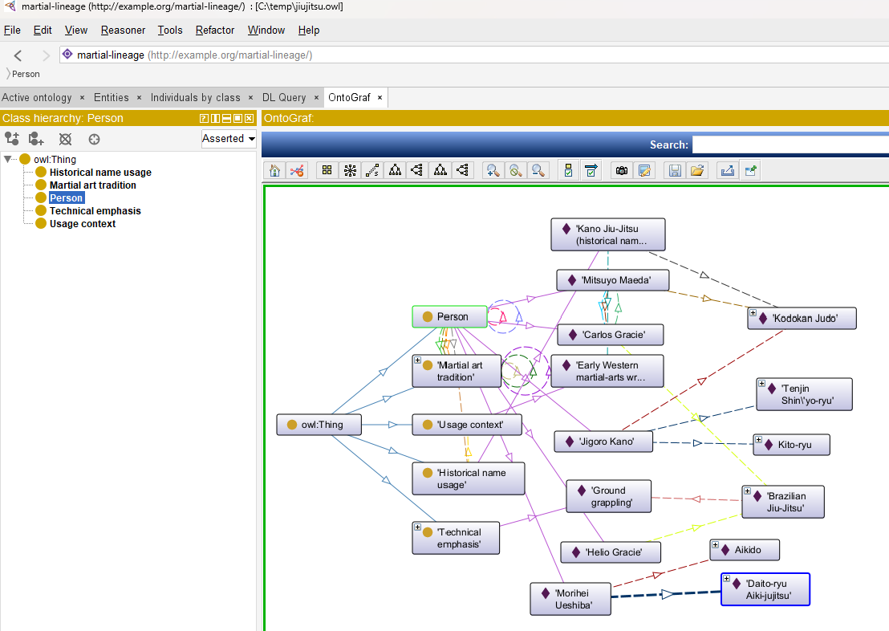

<i>This document accompanies [***Semantic Webs of Meaning: Building Contextual Knowledge Graphs for Deduction and Integration***](https://technicspub.com/semantic-webs-of-meaning/) by Eugene Asahara, published by [Technics Publications](https://technicspub.com).</i>

This document is a recent example of confusion I experienced when a word, jiu-jitsu, presented with meaning not in line with what I understood. It makes for a fun tutorial in semantics.

# Judo, Jiujitsu, and BJJ: When a Name Turns the Family Tree Backwards

In Josh Beam's BJJ YouTube video [*Fighting a judo master to see if my jiu jitsu helps*](https://youtu.be/LSGfF1sV8kU), at about 1:05 he says, "... to test jiu-jitsu against its ancestor sport of judo."

He's said that in other videos as well. Taken literally, to my judo-enthusiast ears, that sounds historically backwards. **Judo developed from older Japanese jiujitsu traditions.** But Josh is a [Brazilian Jiu-Jitsu](https://www.wikidata.org/wiki/Q189336) practitioner, and it seems he uses “jiu jitsu” as shorthand for BJJ. Since that is what he means to say, the statement is correct as it seems **Brazilian Jiu-Jitsu developed downstream from Kodokan judo.**

I've never ever heard anyone refer to BJJ simple as "jiu jitsu", which is why it caught my attention. I later learned that inside BJJ gyms, people often refer to their art as simply Jiu-Jitsu. But I and most other people in the world are not BJJ practitioners.

To be clear, the mistake was mine. I appreciate Josh Beam bringing to light BJJ's judo roots. The "error" I perceived is therefore not really about martial arts. It is about **identity and meaning**.

And that makes this a great RDF example, along with the [Kalbi Plate](https://github.com/MapRock/SemanticWebsOfMeaning/blob/main/book_code/kalbi_plate.md) example. It's a great example because most people don't know the lineage of Judo, BJJ, Aikido, and Jujitsu. So most people wouldn't catch the confusion it might cause.

## The Historical Family Tree

[Jigoro Kano (wd:Q190141)](https://www.wikidata.org/wiki/Q190141) did not invent judo from nothing. The Kodokan’s own history says that Kano studied Tenjin Shinyo-ryu and Kito-ryu classical jujitsu, combined aspects of them with his own ideas, and established the system that became Kodokan judo (ca. 1882). ([Kodokan Global][2])

[Aikido (wd:Q43114)](https://www.wikidata.org/wiki/Q43114) is a sibling to judo that followed a different path. Morihei Ueshiba's most important technical lineage ran through Daito-ryu Aiki-jujitsu; historical records document his long study of Daito-ryu under Sokaku Takeda before the art that became aikido developed separately (ca. 1920). 

So we can extend the picture:




The exact histories are more complicated than this diagram, particularly because “Japanese jujitsu” describes a family of traditions rather than one single ancestral school. But the direction is important.

Then comes Brazilian Jiu-Jitsu.

Mitsuyo Maeda was a Kodokan judoka. He brought his fighting art to Brazil (ca. 1914) and taught Carlos Gracie; the Gracies and other Brazilian lineages continued developing what eventually became Brazilian Jiu-Jitsu. BJJ increasingly distinguished itself through its much greater emphasis on ground fighting. ([Renzo Gracie NH][4])

So:



This is why saying, ":Judo is an ancestor of **BJJ**", is OK. But saying, "Judo is an ancestor of jiujitsu", is backwards **if `jiujitsu` means the older Japanese martial traditions from which judo arose**.

### Homonyms, Synonyms, and Polysemy

The ambiguity here is in the ballpark of familiar ideas such as homonyms and synonyms, but it is not either one. Homonyms are words that share the same spelling **or** sound while referring to what is usually clearly different things, such as bat the animal and bat the piece of sports equipment. Synonyms are different words with the same or nearly the same meaning. Jiu-jitsu is different: the same label is being used for two historically related but distinct martial-art traditions—traditional Japanese jujitsu/jujutsu and Brazilian Jiu-Jitsu. The closest description is lexical ambiguity, or more specifically, polysemy, where one word has related meanings (ex. foot of a person / foot of a mountain).

<i>Note that there is also homonymy, where one word has unrelated meanings (ex. bank river / bank money, mouse animal / mouse computer peripheral)</i>.

What makes this case especially interesting is that the meanings are not obviously different. Unlike mouse, where an animal and a computer device are easy to distinguish, Japanese jujitsu and BJJ are close enough historically and technically that two people can hear the same word, resolve it to different things, and never realize they have done so.

That is exactly the kind of ambiguity RDF is designed to remove. The label jiu-jitsu is only a string. The IRI identifies which thing we actually mean.

## The Label Is Not the Thing

This is exactly the sort of ambiguity the [Semantic Web](https://www.wikidata.org/wiki/Q54837) forces us to confront.

Suppose we write:

```turtle
:JiuJitsu rdfs:label "Jiu Jitsu" .    # The IRI JiuJitsu has a friendly name, "Jiu Jitsu".
```

What have we identified?

Possibly:

* traditional Japanese jujitsu;
* Brazilian Jiu-Jitsu;
* Gracie Jiu-Jitsu;
* an early Western label for judo;
* some other modern jujitsu system.

The string **“jiu jitsu” is not an identity**.

An IRI, [Internationalized Resource Identifier](https://www.wikidata.org/wiki/Q424583), should identify the thing we mean.

So instead, this RDF specifies the martial arts we've mentioned unambiguously:

```turtle
:MartialArtTradition
    a owl:Class ;
    rdfs:label "Martial art tradition" ;
    rdfs:comment
        "An identifiable martial-art system or tradition that can develop, influence other traditions, and have a historical lineage." .

:JapaneseJujitsu
    a :MartialArtTradition ;
    rdfs:label "Japanese jujitsu" ;
    skos:altLabel "jiu-jitsu" .

:KodokanJudo
    a :MartialArtTradition ;
    rdfs:label "Kodokan Judo" .

:BrazilianJiuJitsu
    a :MartialArtTradition ;
    rdfs:label "Brazilian Jiu-Jitsu" ;
    skos:altLabel "BJJ" .

:DaitoRyuAikiJujitsu
    a :MartialArtTradition ;
    rdfs:label "Daito-ryu Aiki-jujitsu" .

:Aikido
    a :MartialArtTradition ;
    rdfs:label "Aikido" .
```

Now five different things have five different identities.

The labels can overlap historically or linguistically without forcing the resources themselves to become the same thing.

That is precisely why this would be wrong:

```turtle
:BrazilianJiuJitsu owl:sameAs :JapaneseJujitsu .
```

They are related historically, but they are not the same thing.

## Relationships Carry the History

Now we can express lineage with relationships rather than relying on names:

```turtle
:hasHistoricalLineageFrom
    a owl:ObjectProperty .

:directlyDevelopedFrom
    a owl:ObjectProperty ;
    rdfs:subPropertyOf :hasHistoricalLineageFrom .

:KodokanJudo
    :hasHistoricalLineageFrom :JapaneseJujitsu .

:DaitoRyuAikiJujitsu
    :hasHistoricalLineageFrom :JapaneseJujitsu .

:Aikido
    :directlyDevelopedFrom :DaitoRyuAikiJujitsu .

:BrazilianJiuJitsu
    :directlyDevelopedFrom :KodokanJudo .
```

Now the important claims are explicit:

- Kodokan Judo  hasHistoricalLineageFrom Japanese Jujitsu
- BJJ directlyDevelopedFrom   Kodokan Judo
- Aikido directlyDevelopedFrom   Daito-ryu Aiki-jujitsu


Notice how much better this is than trying to infer history from the word *jujitsu*.

## Wikidata Version of the RDF

Let's go a step further, redoing the RDF of the martial arts using Wikidata IRI:

```turtle
@prefix :     <http://example.org/martial-arts/> .
@prefix wd:   <http://www.wikidata.org/entity/> .
@prefix rdf:  <http://www.w3.org/1999/02/22-rdf-syntax-ns#> .
@prefix rdfs: <http://www.w3.org/2000/01/rdf-schema#> .
@prefix owl:  <http://www.w3.org/2002/07/owl#> .
@prefix skos: <http://www.w3.org/2004/02/skos/core#> .

# A locally defined class for identifiable martial-art systems or traditions.
:MartialArtTradition
    a owl:Class ;
    rdfs:label "Martial art tradition" ;
    rdfs:comment
        "An identifiable martial-art system or tradition that can develop, influence other traditions, and have a historical lineage." .

# Japanese jujutsu — Wikidata Q163770.
wd:Q163770
    a :MartialArtTradition ;
    rdfs:label "Japanese jujutsu"@en ;
    skos:altLabel "jujitsu"@en,
                  "jiu jitsu"@en,
                  "jiu-jitsu"@en .

# Judo — Wikidata Q11420.
wd:Q11420
    a :MartialArtTradition ;
    rdfs:label "Kodokan Judo"@en .

# Brazilian Jiu-Jitsu — Wikidata Q189336.
wd:Q189336
    a :MartialArtTradition ;
    rdfs:label "Brazilian Jiu-Jitsu"@en ;
    skos:altLabel "BJJ"@en .

# Daitō-ryū Aiki-jūjutsu — Wikidata Q1500342.
wd:Q1500342
    a :MartialArtTradition ;
    rdfs:label "Daitō-ryū Aiki-jūjutsu"@en .

# Aikido — Wikidata Q43114.
wd:Q43114
    a :MartialArtTradition ;
    rdfs:label "Aikido"@en .
```

Further, here are the relationships between the martial arts using the wikidata IRI:

```turtle
:hasHistoricalLineageFrom
    a owl:ObjectProperty ;
    rdfs:domain :MartialArtTradition ;
    rdfs:range :MartialArtTradition ;
    rdfs:label "has historical lineage from" .

# Judo has historical lineage from Japanese jujutsu.
wd:Q11420
    :hasHistoricalLineageFrom wd:Q163770 .

# BJJ has historical lineage from Judo.
wd:Q189336
    :hasHistoricalLineageFrom wd:Q11420 .

# Daitō-ryū has historical lineage from Japanese jujutsu.
wd:Q1500342
    :hasHistoricalLineageFrom wd:Q163770 .

# Aikido has historical lineage from Daitō-ryū Aiki-jūjutsu.
wd:Q43114
    :hasHistoricalLineageFrom wd:Q1500342 .
```
Notice that the martial arts themselves have available Wikidata IRIs, but `:hasHistoricalLineageFrom` does not. Wikidata gives us stable identities for Judo, BJJ, Aikido, and the other traditions, but it does not necessarily provide the exact relationship vocabulary needed for our particular model. That is perfectly normal. We can reuse external identities while defining our own domain-specific relationships. `:hasHistoricalLineageFrom` is not a class of things with a checklist of attributes that determines membership; it expresses a **conceptual relationship** between two martial-art traditions. Its meaning comes from how we define and use the property—its label, domain, range, documentation, and, in this case, its intended transitive behavior. This is an important part of ontology design: reuse established identifiers where they fit, but create explicit local semantics where the meaning you need is not already available. 


## People Are Different Things Again

Mitsuyo Maeda was not a **martial art**. He **practices** a martial art, a person who practiced and transmitted one (a martial artist).
 
So:

```turtle
:Person
    a owl:Class .

:JigoroKano
    a :Person ;
    :founded :KodokanJudo ;
    :studied :TenjinShinyoRyu,
             :KitoRyu .

:MitsuyoMaeda
    a :Person ;
    :practiced :KodokanJudo ;
    :taught :CarlosGracie .

:CarlosGracie
    a :Person ;
    :learnedFrom :MitsuyoMaeda ;
    :helpedDevelop :BrazilianJiuJitsu .

:HelioGracie
    a :Person ;
    :helpedDevelop :BrazilianJiuJitsu .

:MoriheiUeshiba
    a :Person ;
    :studied :DaitoRyuAikiJujitsu ;
    :founded :Aikido .
```

This gives us another useful RDF distinction.

```text
Mitsuyo Maeda               person
Kodokan Judo                martial-art tradition
Brazilian Jiu-Jitsu         martial-art tradition
Ground Grappling            technical emphasis
```

Those are different kinds of things connected through different relationships.

We should therefore resist writing something oversimplified such as:

```turtle
:MitsuyoMaeda :created :BrazilianJiuJitsu .
```

That compresses too much history into one predicate.

Maeda was the crucial transmission point from Kodokan judo into the Brazilian lineage, but BJJ was developed subsequently by the Gracies and other Brazilian practitioners. The Renzo Gracie history explicitly describes Maeda as a Kodokan judoka, Carlos as his student, and the later Gracie system as developing a progressively greater emphasis on ground fighting. ([Renzo Gracie NH][4])

A better graph is:

```turtle
:MitsuyoMaeda
    :practiced :KodokanJudo ;
    :transmittedTo :CarlosGracie .

:CarlosGracie
    :learnedFrom :MitsuyoMaeda ;
    :helpedDevelop :BrazilianJiuJitsu .

:BrazilianJiuJitsu
    :directlyDevelopedFrom :KodokanJudo ;
    :emphasizes :GroundGrappling .
```

That says considerably more without pretending that history was simpler than it was.

## Why Was It Called Jiu-Jitsu in the First Place?

There is another historical complication I read about that offers a hypothesis for Beam's wording understandable.

Early Western usage (first half of the 1900s) did not always cleanly distinguish *judo* from *jujitsu*. A famous 1905 English-language book was actually published under the title *The Complete Kano Jiu-Jitsu (Judo)*. Whatever its technical shortcomings as a representation of actual Kodokan judo, the title itself is evidence of the terminology circulating in the West at the time. ([Internet Archive][5]). That might be why *Brazilian Jiu Jitsu* wasn't called *Brazilian Judo*.

That's not hard to imagine since what we call "AI" in these early days of AI will probably refer to something else or be called something else in the future.

So we should not encode:

```turtle
:KanoJiuJitsu owl:sameAs :KodokanJudo .
```

as though “Kano Jiu-Jitsu” were necessarily a separate martial art that we have proved identical to Kodokan judo.

It may be better to model the **name usage itself**:

```turtle
:KanoJiuJitsuName
    a :HistoricalNameUsage ;
    :nameText "Kano Jiu-Jitsu" ;
    :associatedWith :KodokanJudo ;
    :usageContext :EarlyWesternMartialArtsWriting .
```

Now the graph preserves a subtle historical fact:

> People sometimes used this name in connection with judo.

without turning that linguistic relationship into an identity assertion.

That is much closer to what actually happened.

## The RDF Version of the Misunderstanding

Suppose someone hears “jiu jitsu” and creates:

```turtle
:KodokanJudo
    :ancestorOf :JiuJitsu .
```

The Turtle is perfectly valid, the RDF is perfectly valid, and the statement may still be wrong. The computer cannot know which *jiu jitsu* the author had in mind. If we replace the ambiguous label with an identified resource:

```turtle
:KodokanJudo
    :hasHistoricalLineageFrom :JapaneseJujitsu .
```

the statement makes sense.

If instead we mean BJJ:

```turtle
:BrazilianJiuJitsu
    :hasHistoricalLineageFrom :KodokanJudo .
```

that also makes sense.

What appeared to be a disagreement over martial-arts history was partly an **entity-resolution problem**. There were three meanings to the literal string, jiu jitsu: Japanese jujitsu, Brazilian Jiu-Jitsu, and historical Western terminology of the early 1900s.


## Letting the Graph Follow the Lineage

We can take this a step further.

Suppose `:hasHistoricalLineageFrom` is defined as transitive:

```turtle
:hasHistoricalLineageFrom
    a owl:ObjectProperty,
      owl:TransitiveProperty .
```

and we state:

```turtle
:BrazilianJiuJitsu
    :hasHistoricalLineageFrom :KodokanJudo .

:KodokanJudo
    :hasHistoricalLineageFrom :JapaneseJujitsu .
```

A reasoner can derive:

```turtle
:BrazilianJiuJitsu
    :hasHistoricalLineageFrom :JapaneseJujitsu .
```

That gives us the more complete genealogy: Japanese Jujitsu-->Kodokan Judo-->Brazilian Jiu-Jitsu

Likewise:

```turtle
:Aikido
    :hasHistoricalLineageFrom :DaitoRyuAikiJujitsu .

:DaitoRyuAikiJujitsu
    :hasHistoricalLineageFrom :JapaneseJujitsu .
```

supports:

```turtle
:Aikido
    :hasHistoricalLineageFrom :JapaneseJujitsu .
```

Now the graph can answer a question such as:

```sparql
SELECT ?ancestor
WHERE {
    :BrazilianJiuJitsu
        :hasHistoricalLineageFrom+ ?ancestor .
}
```

and traverse the lineage rather than relying on similarity between names.

## But Lineage Is Not Identity

This is perhaps the most important semantic lesson in the example.

These statements mean very different things:

```turtle
:BrazilianJiuJitsu
    owl:sameAs :KodokanJudo .
```

```turtle
:BrazilianJiuJitsu
    :developedFrom :KodokanJudo .
```

```turtle
:BrazilianJiuJitsu
    :sharesTechniqueWith :KodokanJudo .
```

```turtle
:BrazilianJiuJitsu
    :emphasizes :GroundGrappling .
```

The first says BJJ **is the same thing as** judo.

The second says it has a **historical lineage** from judo.

The third says the two have **technical overlap**.

The fourth describes something particularly important to the development and modern practice of BJJ.

Those are four different claims.

RDF's value is not that it draws lines between things. Almost any graph technology can do that.

Its value is that we are forced to **name what the lines mean**.

## One Word, Two Correct Family Trees

We can now return to the sentence that started the problem.

If *jiu jitsu* means **traditional Japanese jujitsu**, then:

```text
Jujitsu-->Judo
```

Judo is the descendant.

If *jiu jitsu* means **Brazilian Jiu-Jitsu**, then:

```text
 Judo-->BJJ
```

Judo is the ancestor.

So the same English sentence—

> “Judo is the ancestor of jiu jitsu.”

—can be either substantially wrong or substantially right depending upon the identity hidden behind two words.

That is a wonderful example of why a knowledge graph needs more than labels.

A human listening to a BJJ practitioner in a BJJ video will probably resolve the ambiguity automatically: *jiu jitsu* means BJJ. Someone thinking historically about Japanese martial arts may resolve exactly the same words differently.

A knowledge graph cannot safely depend on that invisible context.

It needs:

```turtle
:BrazilianJiuJitsu
```

instead of merely:

```text
"jiu jitsu"
```

and:

```turtle
:developedFrom
```

instead of a vague line labeled:

```text
related to
```

The martial-arts history is interesting in its own right. But the larger RDF lesson is even better:

> **Labels are how we talk about things. IRIs identify which things we mean. Properties state exactly how those things are related.**

And when a single name can reverse an entire family tree, that distinction matters.

## Consolidated OWL to View in Protege

```turtle
@prefix :     <http://example.org/martial-lineage/> .
@prefix owl:  <http://www.w3.org/2002/07/owl#> .
@prefix rdf:  <http://www.w3.org/1999/02/22-rdf-syntax-ns#> .
@prefix rdfs: <http://www.w3.org/2000/01/rdf-schema#> .
@prefix xsd:  <http://www.w3.org/2001/XMLSchema#> .
@prefix skos: <http://www.w3.org/2004/02/skos/core#> .
@prefix wd:   <http://www.wikidata.org/entity/> .

<http://example.org/martial-lineage/>
    a owl:Ontology ;
    rdfs:label "Martial-art lineage example" ;
    rdfs:comment
        "Companion ontology for Semantic Webs of Meaning. Shows that the string 'jiu jitsu' is not an identity, and that lineage, overlap, emphasis, and name usage are different relations." .

#################################################################
# Classes
#################################################################

:MartialArtTradition
    a owl:Class ;
    rdfs:label "Martial art tradition" ;
    rdfs:comment
        "An identifiable martial-art system or tradition that can develop, influence other traditions, and have a historical lineage." .

:Person
    a owl:Class ;
    rdfs:label "Person" .

:TechnicalEmphasis
    a owl:Class ;
    rdfs:label "Technical emphasis" ;
    rdfs:comment "A characteristic focus of practice, such as ground grappling." .

:HistoricalNameUsage
    a owl:Class ;
    rdfs:label "Historical name usage" ;
    rdfs:comment
        "A recorded use of a name in a context. This is not the art itself." .

:UsageContext
    a owl:Class ;
    rdfs:label "Usage context" .

#################################################################
# Properties
#################################################################

:hasHistoricalLineageFrom
    a owl:ObjectProperty, owl:TransitiveProperty ;
    rdfs:label "has historical lineage from" ;
    rdfs:domain :MartialArtTradition ;
    rdfs:range :MartialArtTradition ;
    rdfs:comment
        "Transitive historical descent. Not identity. Not mere technical overlap." .

:directlyDevelopedFrom
    a owl:ObjectProperty ;
    rdfs:subPropertyOf :hasHistoricalLineageFrom ;
    rdfs:label "directly developed from" ;
    rdfs:domain :MartialArtTradition ;
    rdfs:range :MartialArtTradition .

:sharesTechniqueWith
    a owl:ObjectProperty, owl:SymmetricProperty ;
    rdfs:label "shares technique with" ;
    rdfs:domain :MartialArtTradition ;
    rdfs:range :MartialArtTradition .

:emphasizes
    a owl:ObjectProperty ;
    rdfs:label "emphasizes" ;
    rdfs:domain :MartialArtTradition ;
    rdfs:range :TechnicalEmphasis .

:founded
    a owl:ObjectProperty ;
    rdfs:label "founded" ;
    rdfs:domain :Person ;
    rdfs:range :MartialArtTradition .

:studied
    a owl:ObjectProperty ;
    rdfs:label "studied" ;
    rdfs:domain :Person ;
    rdfs:range :MartialArtTradition .

:practiced
    a owl:ObjectProperty ;
    rdfs:label "practiced" ;
    rdfs:domain :Person ;
    rdfs:range :MartialArtTradition .

:taught
    a owl:ObjectProperty ;
    rdfs:label "taught" ;
    rdfs:domain :Person ;
    rdfs:range :Person .

:learnedFrom
    a owl:ObjectProperty ;
    rdfs:label "learned from" ;
    owl:inverseOf :taught .

:helpedDevelop
    a owl:ObjectProperty ;
    rdfs:label "helped develop" ;
    rdfs:domain :Person ;
    rdfs:range :MartialArtTradition .

:transmittedTo
    a owl:ObjectProperty ;
    rdfs:label "transmitted to" ;
    rdfs:domain :Person ;
    rdfs:range :Person ;
    rdfs:comment
        "A person taught another person. This is not the same as creating an art." .

:associatedWith
    a owl:ObjectProperty ;
    rdfs:label "associated with" ;
    rdfs:domain :HistoricalNameUsage ;
    rdfs:range :MartialArtTradition .

:usedInContext
    a owl:ObjectProperty ;
    rdfs:label "used in context" ;
    rdfs:domain :HistoricalNameUsage ;
    rdfs:range :UsageContext .

:nameText
    a owl:DatatypeProperty ;
    rdfs:label "name text" ;
    rdfs:domain :HistoricalNameUsage ;
    rdfs:range xsd:string .

#################################################################
# Traditions
# JapaneseJujitsu is a stand-in for a family of schools, not one ryu.
#################################################################

:JapaneseJujitsu
    a :MartialArtTradition ;
    rdfs:label "Japanese jujitsu" ;
    skos:altLabel "jiu-jitsu", "jujutsu", "jujitsu" ;
    rdfs:comment
        "A family of classical Japanese grappling traditions, used here as one node for a simplified lineage. It is not a single school." ;
    skos:closeMatch wd:Q163770 .

:TenjinShinyoRyu
    a :MartialArtTradition ;
    rdfs:label "Tenjin Shin'yo-ryu" ;
    :hasHistoricalLineageFrom :JapaneseJujitsu .

:KitoRyu
    a :MartialArtTradition ;
    rdfs:label "Kito-ryu" ;
    :hasHistoricalLineageFrom :JapaneseJujitsu .

:KodokanJudo
    a :MartialArtTradition ;
    rdfs:label "Kodokan Judo" ;
    skos:altLabel "judo" ;
    :hasHistoricalLineageFrom :JapaneseJujitsu, :TenjinShinyoRyu, :KitoRyu ;
    skos:closeMatch wd:Q11420 .

:DaitoRyuAikiJujitsu
    a :MartialArtTradition ;
    rdfs:label "Daito-ryu Aiki-jujitsu" ;
    :hasHistoricalLineageFrom :JapaneseJujitsu ;
    skos:closeMatch wd:Q1500342 .

:Aikido
    a :MartialArtTradition ;
    rdfs:label "Aikido" ;
    :directlyDevelopedFrom :DaitoRyuAikiJujitsu ;
    skos:closeMatch wd:Q43114 .

:BrazilianJiuJitsu
    a :MartialArtTradition ;
    rdfs:label "Brazilian Jiu-Jitsu" ;
    skos:altLabel "BJJ", "jiu-jitsu", "jiu jitsu" ;
    :directlyDevelopedFrom :KodokanJudo ;
    :emphasizes :GroundGrappling ;
    skos:closeMatch wd:Q189336 .

:GroundGrappling
    a :TechnicalEmphasis ;
    rdfs:label "Ground grappling" .

#################################################################
# People
#################################################################

:JigoroKano
    a :Person ;
    rdfs:label "Jigoro Kano" ;
    :studied :TenjinShinyoRyu, :KitoRyu ;
    :founded :KodokanJudo ;
    skos:closeMatch wd:Q190141 .

:MitsuyoMaeda
    a :Person ;
    rdfs:label "Mitsuyo Maeda" ;
    :practiced :KodokanJudo ;
    :taught :CarlosGracie ;
    :transmittedTo :CarlosGracie ;
    skos:closeMatch wd:Q1352463 .

:CarlosGracie
    a :Person ;
    rdfs:label "Carlos Gracie" ;
    :learnedFrom :MitsuyoMaeda ;
    :helpedDevelop :BrazilianJiuJitsu .

:HelioGracie
    a :Person ;
    rdfs:label "Helio Gracie" ;
    :helpedDevelop :BrazilianJiuJitsu .

:MoriheiUeshiba
    a :Person ;
    rdfs:label "Morihei Ueshiba" ;
    :studied :DaitoRyuAikiJujitsu ;
    :founded :Aikido ;
    skos:closeMatch wd:Q182130 .

#################################################################
# A name is not an art
#################################################################

:EarlyWesternMartialArtsWriting
    a :UsageContext ;
    rdfs:label "Early Western martial-arts writing" .

:KanoJiuJitsuName
    a :HistoricalNameUsage ;
    rdfs:label "Kano Jiu-Jitsu (historical name)" ;
    :nameText "Kano Jiu-Jitsu" ;
    :associatedWith :KodokanJudo ;
    :usedInContext :EarlyWesternMartialArtsWriting ;
    rdfs:comment
        "A Western name used in connection with judo, including the 1905 book title The Complete Kano Jiu-Jitsu (Judo). This usage is not owl:sameAs Kodokan Judo." .

#################################################################
# Explicitly not asserted
# :BrazilianJiuJitsu owl:sameAs :JapaneseJujitsu .
# :BrazilianJiuJitsu owl:sameAs :KodokanJudo .
# :KanoJiuJitsuName owl:sameAs :KodokanJudo .
# :MitsuyoMaeda :founded :BrazilianJiuJitsu .
#################################################################
```
Here is a snapshot of that OWL loaded into Protege:



Also see this article's sister piece: [When Sedans Have Four Doors Means Five Different Things in RDF](https://eugeneasahara.com/2026/08/24/when-sedans-have-four-doors-means-five-different-things-in-rdf/).

[1]: https://www.youtube.com/watch?v=LSGfF1sV8kU&vl=en-US "Fighting a judo master to see if my jiu jitsu helps"
[2]: https://kdkjd.org/%E8%AC%9B%E9%81%93%E9%A4%A8%E6%9F%94%E9%81%93%E3%81%AE%E6%AD%B4%E5%8F%B2/ "History of Kodokan Judo – Kodokan Global"
[3]: https://www.daito-ryu.org/en/daito-ryu-and-aikido.html "Daito-ryu and aikido"
[4]: https://renzogracienh.org/brazilian-jiu-jitsu-history/ "Renzo Gracie NH | Brazilian Jiu Jitsu History"
[5]: https://archive.org/details/completekanojiuj0000hanc "The complete Kano jiu-jitsu (judo) : Hancock, H. Irving ..."
