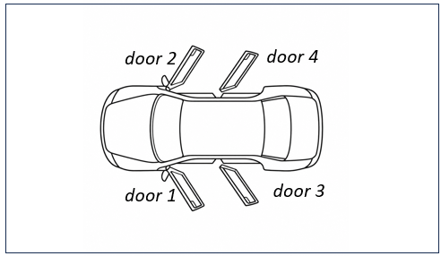

<i>This document accompanies [***Semantic Webs of Meaning: Building Contextual Knowledge Graphs for Deduction and Integration***](https://technicspub.com/semantic-webs-of-meaning/) by Eugene Asahara, published by [Technics Publications](https://technicspub.com).</i>

# When “Sedans Have Four Doors” Means Five Different Things in RDF

It's surprising how much our brains do towards correctly interpreting what we people say to us using our loose language. But the looseness of language means there is the door for misinterpretation. For AI, this is even worse since it currently doesn't live immersed into our physical world. 

A surprising lesson in RDF and OWL can be found in this ordinary statement:

> **A sedan has four doors.**

To a human, that sentence seems simple. But what exactly does it mean?

Does it mean that four doors are part of the **definition of the class Sedan**? Does it mean that sedans **typically** have four doors? Does it describe one particular sedan? Are the doors merely counted, or are the doors themselves things we want to represent and reason about?

| Interpretation                                       | What it means                                                                                                                                                                                                               |
| ---------------------------------------------------- | --------------------------------------------------------------------------------------------------------------------------------------------------------------------------------------------------------------------------- |
| **“Sedans have four doors.”**                        | A general statement about sedans as a category. It is ambiguous: it may mean that four doors are typical, expected, or universally true of sedans. RDF/OWL forces us to decide which meaning is intended.                   |
| **“A sedan has four doors.”**                        | A statement about an unspecified member of the Sedan class. Depending on context, it could mean a typical sedan or an arbitrary sedan, so it still does not tell us whether the claim is descriptive or logically required. |
| **“This sedan has four doors.”**                     | A statement about one particular sedan individual. This is naturally represented as a property assertion on that individual, such as `:MySedan :doorCount 4`.                                                               |
| **“Four doors are typical of sedans.”**              | A descriptive statement about the Sedan category, not a rule that must hold for every instance. This is better treated as annotation or descriptive metadata than as a universal OWL restriction.                           |
| **“Four doors are part of my definition of Sedan.”** | A formal ontological claim: membership in the Sedan class requires the specified door condition. This is the case for an OWL restriction or, if intended as a complete definition, an `owl:equivalentClass` expression.     |


Those interpretations require different RDF and OWL statements.

Understanding the differences is important because RDF triples are very literal. The triple says something about its subject. It does not automatically turn a property attached to a class into a property of every member of that class.

The original title of this article was, "Does Semantics Make Us A-holes". Clear understanding is necessary, but nonetheless, it doesn't make you more fun to be around.

## Classes and Instances

Start with the basic taxonomy:

```turtle
@prefix :    <http://example.org/cars/> .
@prefix rdf: <http://www.w3.org/1999/02/22-rdf-syntax-ns#> .
@prefix rdfs:<http://www.w3.org/2000/01/rdf-schema#> .
@prefix owl: <http://www.w3.org/2002/07/owl#> .
@prefix xsd: <http://www.w3.org/2001/XMLSchema#> .

# Car is a Class.
:Car a owl:Class .

# Sedan is a subclass of Car.
:Sedan rdfs:subClassOf :Car .
```

We have a hierarchy consisting of the root, Car, with a child of Sedan.


More precisely:

> Every individual that is a `Sedan` is also a `Car`.

Now we can introduce an actual car (a car I bought from a car dealership):

```turtle
# My Taurus is a Sedan.
:MyTaurus a :Sedan .
```

From these two statements:

```turtle
:Sedan rdfs:subClassOf :Car .    # Sedan is a sub class of Car.
:MyTaurus a :Sedan .            # My Taurus is a Sedan.
```

an RDFS or OWL reasoner can infer:

```turtle
:MyTaurus a :Car . # My Taurus is a car.
```

This is genuine class membership inheritance.

That distinction—**class versus instance**—becomes important when we add the doors.

---

## Interpretation 1: One Particular Car Has Four Doors

Perhaps we are simply describing `:MyTaurus`.

The easiest representation is a datatype property:

```turtle
# Define a property for the number of doors.
:doorCount
    a owl:DatatypeProperty ;
    rdfs:domain :Car ;
    rdfs:range xsd:integer .

# My Taurus has 4 doors. This doesn't mean all Taurus' have four doors, nor do Sedans.
:MyTaurus
    a :Sedan ;
    :doorCount 4 .
```

This says:

> `MyTaurus` has a door count of 4.

There is no statement here that all sedans have four doors.

Another sedan could have:

```turtle
# Kevin's Camry has three doors. Odd, but it does.
:KevinCamry
    a :Sedan ;
    :doorCount 3 .
```

Nothing in the ontology as written prevents that.

The property assertion describes **the individual car**.

---

## Interpretation 2: Four Doors Are a Characteristic of Every Sedan

Suppose we mean something stronger:

> By definition, every Sedan has a door count of 4.

Then four doors are a **class-level characteristic**, but in OWL we normally express that characteristic as a restriction on the members of the class:

```turtle
:Sedan
    rdfs:subClassOf [
        a owl:Restriction ;
        owl:onProperty :doorCount ;
        owl:hasValue 4
    ] .
```

Read this as:

> Every Sedan belongs to the class of things whose `doorCount` has the value 4.

Now if:

```turtle
:MyTaurus a :Sedan .
```

an OWL reasoner can infer:

```turtle
:MyTaurus :doorCount 4 .
```

This is probably what we ordinarily mean when we informally say:

> “Four doors is a property of the Sedan class.”

That statement is perfectly reasonable in human ontology language.

The technical subtlety is that OWL expresses a property that applies to **members of the class** using a class restriction. 

---


## Interpretation 3: “Sedans Typically Have Four Doors”

Now change the sentence slightly:

> Sedans **typically** have four doors.

That is not the same assertion.

There are unusual vehicles, historical classifications, marketing categories, regional definitions, and edge cases. Perhaps four doors is merely how our taxonomy characterizes the category.

Then making this a hard OWL restriction may be too strong.

We could instead describe the class itself:

```turtle
:typicalDoorCount
    a owl:AnnotationProperty .

:Sedan
    a owl:Class ;
    rdfs:subClassOf :Car ;
    :typicalDoorCount 4 .
```

This says something about our **concept of Sedan**:

> In this taxonomy, Sedan is characterized as typically having four doors.

It does not entail:

```turtle
:MyTaurus :doorCount 4 .
```

That may be exactly what we want.

This distinction is especially important in taxonomies intended to describe tendencies, comparisons, or conventional characteristics rather than rigid logical definitions.

---

## Why This Does Not Work the Way We Might Expect

Suppose instead we write:

```turtle
:doorCount
    a owl:DatatypeProperty .

:Sedan
    :doorCount 4 .
```

A human might read this as:

> Sedans have four doors.

But RDF sees:

```text
Subject       Predicate      Object
-------       ---------      ------
:Sedan        :doorCount     4
```

The subject is the resource identified by `:Sedan`.

It does **not** mean that every manufactured Sedan has 4 doors:

```text
For every x:
    if x is a Sedan,
    x has doorCount 4.
```

There is no implicit propagation from properties asserted on a class resource to the instances of that class.

This:

```turtle
:Sedan rdfs:subClassOf :Car .
```

has subclass semantics.

This:

```turtle
:Sedan :doorCount 4 .
```

does not.

That is one of the easiest traps in RDF because ordinary language routinely blurs these two meanings.

### Properties of the Class Versus Properties Defined by the Class

There is nothing wrong with a class having properties of its own.

Suppose we maintain ontology metadata:

```turtle
:Sedan
    :definitionSource :AutomotiveTaxonomy ;
    :taxonomyCode "SED" ;
    :approvedBy :VehicleStandardsCommittee .
```

Those statements really are about the **class `Sedan` itself**.

They could mean:

> The Sedan category has code SED.
> The Sedan category comes from this taxonomy.
> This committee approved the definition of Sedan.

We certainly do not mean:

> Every individual sedan has taxonomy code SED and was approved by the Vehicle Standards Committee.

So properties attached directly to classes can be perfectly legitimate. We simply need to understand what they mean.

A useful distinction is:

| Intended statement                         | RDF/OWL technique                                 |
| ------------------------------------------ | ------------------------------------------------- |
| Something about the class itself           | Property or annotation on the class               |
| Something typically true of members        | Class metadata/annotation describing the tendency |
| Something necessarily true of every member | OWL class restriction                             |
| Something true of one particular member    | Property assertion on the individual              |

---

# Datatype Properties Versus Object Properties

So far we have represented the number of doors as a literal:

```turtle
:MyTaurus :doorCount 4 .
```

That uses a **datatype property** because the object is a literal value.

```text
MyTaurus ──doorCount──> 4
                       ^
                       literal
```

But perhaps the doors themselves matter.

We might want to know:

* which door was damaged;
* which door contains a particular sensor;
* which door was replaced;
* which door is open;
* whether front and rear doors differ;
* whether a particular component belongs to a particular door.

Then doors should become objects in the graph.

```turtle
:Door
    a owl:Class .

:hasDoor
    a owl:ObjectProperty ;
    rdfs:domain :Car ;
    rdfs:range :Door .
```

Now:

```turtle
:MyTaurus
    a :Sedan ;
    :hasDoor :Door1,
             :Door2,
             :Door3,
             :Door4 .

:Door1 a :Door .
:Door2 a :Door .
:Door3 a :Door .
:Door4 a :Door .
```


The graph is now:

```text
                   Door1
                    ^
                    |
                   hasDoor
                    |
Door2 <--hasDoor-- MyTaurus --hasDoor--> Door3
                    |
                   hasDoor
                    |
                    v
                   Door4
```

This is an **object property** because it connects one resource to another resource.

Compare:

```turtle
:MyTaurus :doorCount 4 .
```

with:

```turtle
:MyTaurus :hasDoor :Door1 .
```

The first links an entity to a literal.

The second links one entity to another entity.

---

# Defining Sedan Using the Door Objects

If we model doors individually, we can define the Sedan restriction in terms of `:hasDoor`.

For example:

```turtle
:Sedan
    a owl:Class ;
    rdfs:subClassOf :Car ;
    rdfs:subClassOf [
        a owl:Restriction ;
        owl:onProperty :hasDoor ;
        owl:qualifiedCardinality "4"^^xsd:nonNegativeInteger ;
        owl:onClass :Door
    ] .
```

This says:

> Every Sedan has exactly four `Door` individuals through the `hasDoor` relationship.

This is richer than:

```turtle
:doorCount 4
```

because the four doors now have identities and can themselves participate in the knowledge graph.

For example:

```turtle
:FrontLeftDoor
    a :Door ;
    :position :FrontLeft ;
    :contains :SideImpactSensor17 .

:MyTaurus
    :hasDoor :FrontLeftDoor .
```

We can continue following relationships through the graph.

That is one reason knowledge graphs often model important things as entities rather than reducing everything to literal attributes.

---

# But Cardinality Reveals the Open-World Assumption

There is another subtlety here.

Suppose our ontology says a Sedan has exactly four doors:

```turtle
:Sedan
    rdfs:subClassOf [
        a owl:Restriction ;
        owl:onProperty :hasDoor ;
        owl:qualifiedCardinality "4"^^xsd:nonNegativeInteger ;
        owl:onClass :Door
    ] .
```

and an instance (real car) contains only:

```turtle
:MyTaurus
    a :Sedan ;
    :hasDoor :Door1,
             :Door2,
             :Door3 .
```

OWL does **not** necessarily conclude:

> Error! MyTaurus has only three doors.

RDF/OWL normally operates under the **open-world assumption**. Absence doesn't imply non-existance.

The graph says that three doors are known. It does not say there cannot be another door that has simply not been stated.

Similarly, suppose five door IRIs are listed. OWL cannot necessarily assume that all five denote different things unless their distinctness is known.

This is an important difference between:

> reasoning about what must be true,

and:

> validating whether a data record contains exactly the expected four values.

For strict data validation, SHACL may be the more natural mechanism.

The same innocent Sedan example therefore leads directly into one of the most important distinctions in Semantic Web technology:

**OWL describes and reasons about the world; SHACL can validate whether supplied data conforms to expected shapes.**

---

# Necessary Versus Sufficient Conditions

There is still another possible interpretation of:

> A Sedan is a Car with four doors.

Suppose we write:

```turtle
:Sedan
    rdfs:subClassOf :Car ;
    rdfs:subClassOf [
        a owl:Restriction ;
        owl:onProperty :doorCount ;
        owl:hasValue 4
    ] .
```

This means:

```text
Sedan → Car
Sedan → four doors
```

Every Sedan is a Car with four doors.

But the reverse is not stated.

If we encounter:

```turtle
:MysteryCar
    a :Car ;
    :doorCount 4 .
```

we cannot infer merely from that definition that:

```turtle
:MysteryCar a :Sedan .
```

Four doors may be a **necessary** property of a Sedan without being sufficient to identify one.

Perhaps hatchbacks also have four doors.

Suppose, merely for illustration, we declare that being a Car with exactly four doors is the complete definition of Sedan. Then we can use an equivalent class:

```turtle
:Sedan
    owl:equivalentClass [
        a owl:Class ;
        owl:intersectionOf (
            :Car
            [
                a owl:Restriction ;
                owl:onProperty :doorCount ;
                owl:hasValue 4
            ]
        )
    ] .
```

Now the reasoning runs both ways:

```text
Sedan
   →
Car with four doors

and

Car with four doors
   →
Sedan
```

The second direction is much stronger.

It allows a reasoner to **classify an individual as a Sedan from its characteristics**.

---

# Domain and Range Add Another Kind of Meaning

Consider:

```turtle
:hasDoor
    a owl:ObjectProperty ;
    rdfs:domain :Car ;
    rdfs:range :Door .
```

It is tempting to read this like a database constraint:

> `hasDoor` may only be used on Cars, and its target must be a Door.

RDFS semantics are somewhat different.

If we state:

```turtle
:MysteryObject :hasDoor :Something .
```

the domain and range can support the inferences:

```turtle
:MysteryObject a :Car .
:Something a :Door .
```

In other words, domain and range contribute **meaning and inference**. They are not merely error-checking declarations.

Again, RDF modeling asks us to distinguish:

> What do I want to infer?

from:

> What do I want to reject as invalid data?

Those are not always the same job.

---

# One Sentence, Several Models

We can now return to the original sentence:

> **Sedans have four doors.**

Depending upon what we mean, we might encode it in several different ways.

### A particular sedan has four doors

```turtle
:MyTaurus
    a :Sedan ;
    :doorCount 4 .
```

### Four doors are a necessary characteristic of every Sedan

```turtle
:Sedan
    rdfs:subClassOf [
        a owl:Restriction ;
        owl:onProperty :doorCount ;
        owl:hasValue 4
    ] .
```

### Sedans typically have four doors

```turtle
:Sedan
    :typicalDoorCount 4 .
```

where `:typicalDoorCount` is deliberately metadata describing the category rather than an inherited property.

### The Sedan category has some administrative property

```turtle
:Sedan
    :taxonomyCode "SED" .
```

That is genuinely a fact about the class resource.

### A particular sedan is related to four actual door entities

```turtle
:MyTaurus
    :hasDoor :Door1,
             :Door2,
             :Door3,
             :Door4 .
```

### Having four doors is sufficient as well as necessary to classify a Car as a Sedan

Use an `owl:equivalentClass` definition rather than merely `rdfs:subClassOf`.

The English sentence did not tell us which of these meanings was intended.

The ontology must.

---

# The Larger Lesson

This is one of the most important lessons in knowledge-graph modeling. RDF gives us an extremely simple structure:

```text
subject → predicate → object
```

But that simplicity does not relieve us from deciding what our statements mean. Here is the checklist points for this article:

- A class is a resource.

- An instance is a resource.

- A property may connect a resource to another resource or to a literal.

- A class may have metadata describing the class itself.

- A class restriction may describe what must be true of its members.

- A subclass relationship says that membership in one class implies membership in another.

- An equivalent-class definition can allow classification in both directions.

- A descriptive statement such as “Sedans usually have four doors” should not automatically be promoted into a universal logical axiom.

The hard part is therefore often not writing Turtle. The hard part is deciding **which claim we intend to make**.

That is where knowledge graphs force discipline. Human language effortlessly slides between the interpretations of sedans and four doors.

To a human, context often resolves the difference without conscious effort. To an ontology, those are different claims.

Making those differences explicit is not an inconvenience of RDF. **It is much of the point of RDF and OWL.**
