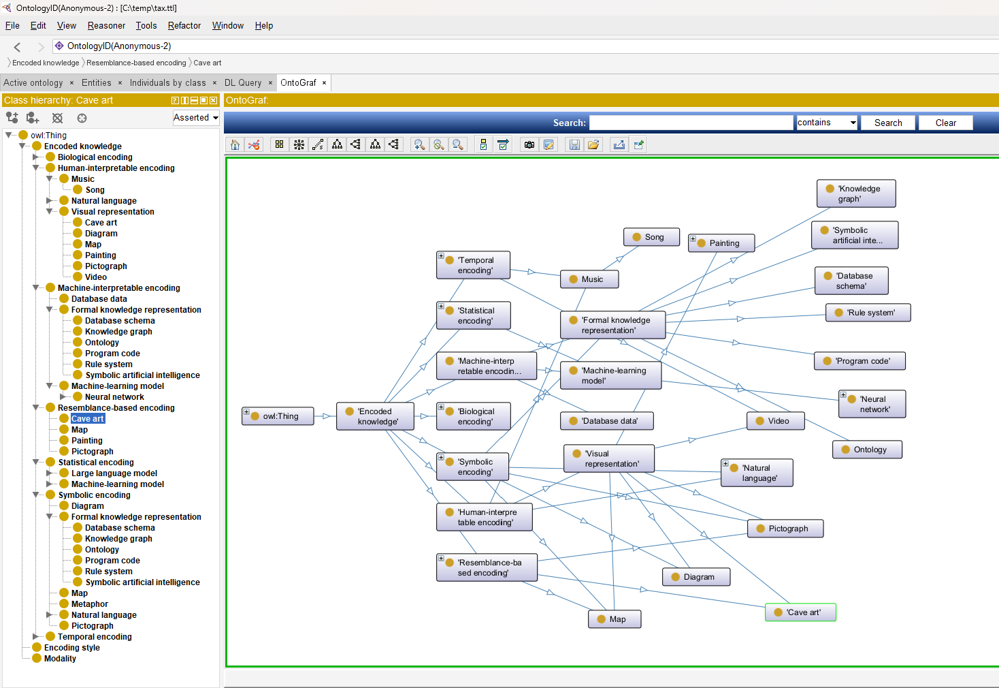

<i>This document accompanies [***Semantic Webs of Meaning: Building Contextual Knowledge Graphs for Deduction and Integration***](https://technicspub.com/semantic-webs-of-meaning/) by Eugene Asahara, published by [Technics Publications](https://technicspub.com).</i>

# A Taxonomy of Encoded Knowledge

Knowledge does not exist only in books, databases, or brains. It can be encoded in words, sounds, gestures, pictures, maps, equations, computer programs, stories, database schemas, knowledge graphs, neural networks, and many other forms.

Each form preserves some aspects of knowledge while sacrificing others.

A knowledge graph can state a relationship with great precision:

```text
Laurie manages the Legal department.
```

A painting may communicate something about Laurie that cannot be reduced to a few triples. A video can preserve movement, timing, voice, surroundings, and interaction. A poem can express an emotional or conceptual structure in a few carefully selected words, but only for a reader who brings enough background knowledge to interpret them.

The important question is therefore not merely:

> Where is knowledge stored?

It is:

> How is knowledge encoded, what must already be known to decode it, and what is lost in the encoding?

## Encoding and Decoding

Human thought is not normally transmitted directly from one brain to another. It must first be serialized into something observable:

* speech;
* writing;
* facial expression;
* gesture;
* music;
* drawing;
* program code;
* physical action.

The recipient then deserializes that signal using previously learned patterns.

A written word is visibly a set of marks. Those marks become meaningful only to a brain trained to recognize the alphabet, vocabulary, grammar, context, and subject matter. Spoken language depends on recognizing structured sounds. Gesture depends on learned relationships between movement, situation, and intention.

Even apparently direct representations require prior knowledge. A map depends on conventions concerning scale, orientation, color, borders, symbols, and location. A database schema depends on knowledge of tables, columns, keys, data types, and the modeled business. A knowledge graph depends on understanding its vocabulary and ontology.

There may be no knowledge representation that requires absolutely no background knowledge.

## Symbolic and Resemblance-Based Encoding

Documents are symbolic because words and punctuation represent concepts through learned conventions. Program code is also symbolic, but more rigid. Its syntax and operational meaning must be precise enough for a computer (machine) to execute.

Other representations communicate partly through resemblance. A portrait resembles its subject. Cave art may depict animals, hunting, movement, or relationships. A pictograph resembles the concept it represents more directly than an alphabetic word does.

This distinction is not absolute. A map combines resemblance with symbols. A painting may contain recognizable objects, culturally learned symbols, abstraction, and emotional suggestion. Written Chinese characters may contain historical pictorial elements but function today within a highly developed symbolic language.

Forms of encoded knowledge overlap.

## Knowledge Through Time

Some knowledge can be represented in a static form:

* a sentence;
* a diagram;
* a photograph;
* a database row;
* an RDF triple.

Other forms must be expressed over time:
* speech;
* music;
* physical action;
* animation;
* video;
* a business process.

A video is not merely a collection of pictures. It preserves ordered change across time and usually includes synchronized audio. A song depends on pitch, duration, sequence, rhythm, dynamics, and often language. Rearranging the same notes or words changes the knowledge or experience being communicated.

Stories are another temporal encoding. Their meaning depends not only on which events occur, but on their order, pace, causality, expectations, and resolution.

## Compression Through Shared Knowledge

A poem, metaphor, analogy, executive summary, abstract, or elevator pitch compresses a larger structure into a smaller signal.

The compression works because the author assumes the reader already knows much of what was omitted.

Consider:

> The project became the Titanic.

Very little information is stated explicitly. Yet a reader familiar with the Titanic may infer ambition, overconfidence, hidden danger, catastrophic failure, and perhaps warnings that were ignored.

Metaphor achieves compression by pointing to an existing structure in the recipient’s memory. Without that background knowledge, the compressed message fails.

Technical communication works the same way. A database architect can say “slowly changing dimension” without explaining the entire pattern. A logician can write `A → B`. A musician can read notation. Compression depends upon a shared decoder.

## Program Code and Databases

Program code encodes knowledge about how something should operate.

A tax calculation program contains knowledge of tax rules. A scheduling algorithm contains knowledge of constraints and priorities. An application workflow contains assumptions about how work proceeds. However, that knowledge is explicit only to someone who understands the language, libraries, architecture, and business context.

Code is precise but rigid. It handles exactly what was programmed, including the errors and omissions that were programmed into it.

Databases encode knowledge in at least two layers:

1. **The schema** encodes categories, attributes, relationships, keys, and constraints.
2. **The data** encodes assertions about particular things and events.

A foreign key may tell us that employees are associated with departments. The rows tell us which employee is associated with which department. Queries can derive additional knowledge from the combination.

But much of the meaning remains implicit—in naming conventions, documentation, application behavior, institutional memory, and the minds of developers.

## Knowledge Graphs

Knowledge graphs attempt to make more of that meaning explicit.

A graph can directly declare that:

```turtle
:Manager rdfs:subClassOf :Employee .
:managesDepartment rdfs:subPropertyOf :worksInDepartment .
:managedBy owl:inverseOf :managesDepartment .
```

These are not merely storage relationships. They describe how concepts should be interpreted and what conclusions may follow.

Knowledge graphs are therefore closely associated with symbolic knowledge representation and symbolic AI. Wikidata describes a knowledge graph as an information repository structured as entities and relationships, while symbolic AI relies on high-level symbolic representations, logic, and search. ([Wikidata][1])

Their strength is explicitness:

* concepts can be named;
* relationships can be inspected;
* rules can be reviewed;
* provenance can be attached;
* deductions can be explained.

But explicitness also imposes a cost. Every explicit model is selective. A triple stating that two people are friends does not capture the entire history, emotional texture, ambiguity, and changing nature of the friendship.

The graph gains precision by leaving much unsaid.

## Large Language Models

An LLM encodes knowledge differently. Wikidata characterizes an LLM as a language model built using very large amounts of text. Its learned knowledge is distributed through numerical parameters rather than represented as a readily inspectable collection of facts and rules. ([Wikidata][2])

An LLM’s architecture, training software, and objectives are programmed. But much of its resulting behavior is learned statistically from examples.

That gives an LLM broad coverage and sensitivity to linguistic nuance. It can work with ambiguity, analogy, style, context, and incomplete descriptions. But it may be difficult to determine precisely where a particular answer came from or which internal relationship produced it.

The contrast is not simply:

```text
Knowledge graph = intelligent
LLM = intelligent
```

It is a contrast in how knowledge is encoded:

```text
Knowledge graph
    explicit terms, assertions, relationships, and rules

Large language model
    distributed statistical relationships in learned parameters
```

Modern systems can combine both. The LLM supplies flexibility, language understanding, synthesis, and analogy. The knowledge graph supplies explicit identity, governed meaning, provenance, constraints, and explainable inference.

## The Brain as Encoded Knowledge

The human brain is also a form of encoded knowledge, although not one we can yet read as a document or database.

Learning changes neural structure and behavior. Recognition allows sensory patterns to activate memories, associations, emotions, and actions. But to communicate that knowledge, the brain must serialize some part of it into speech, writing, music, drawing, gesture, or action.

The receiver then reconstructs something—not necessarily the same thing—in another brain.

Communication is therefore not the transfer of an intact thought. It is the transmission of an encoded signal from which another system attempts to reconstruct meaning.

## A More Useful Taxonomy

A single hierarchy is not enough because representations can belong to several categories at once. A song is linguistic, musical, temporal, and acoustic. A map is visual, spatial, symbolic, and partly resemblance-based. Program code is textual, symbolic, formal, and executable.

It is better to classify encoded knowledge along several dimensions:

| Dimension                               | Examples                                                   |
| --------------------------------------- | ---------------------------------------------------------- |
| **Symbolic explicitness**               | RDF triples, equations, program code, database schemas     |
| **Statistical or distributed encoding** | Neural networks and LLM parameters                         |
| **Resemblance-based encoding**          | Paintings, photographs, pictographs, diagrams              |
| **Linguistic encoding**                 | Speech, documents, stories, poems                          |
| **Temporal dependence**                 | Music, speech, video, processes                            |
| **Executability**                       | Program code, rules, workflows                             |
| **Required background knowledge**       | Vocabulary, culture, domain expertise, notation            |
| **Degree of compression**               | Metaphors, summaries, formulas, abstracts                  |
| **Interpretive flexibility**            | Art and stories versus formal logic and code               |
| **Inspectability**                      | Explicit graph assertions versus distributed model weights |

No representation dominates every dimension.

A photograph preserves visual detail but not necessarily causality. A rule is precise but may omit context. A story preserves sequence and motivation but may be ambiguous. An LLM captures broad statistical associations but not as governed explicit assertions. A knowledge graph exposes its structure but cannot economically encode every nuance of the world.

The interesting future is not choosing one representation. It is learning how to connect them.

---

# A Succinct Knowledge Graph Taxonomy

The following Turtle is intentionally **polyhierarchical**. It does not claim that every representation belongs in only one branch.



```turtle
@prefix :     <http://example.org/encoded-knowledge/> .
@prefix owl:  <http://www.w3.org/2002/07/owl#> .
@prefix rdfs: <http://www.w3.org/2000/01/rdf-schema#> .
@prefix skos: <http://www.w3.org/2004/02/skos/core#> .
@prefix wd:   <http://www.wikidata.org/entity/> .

# ------------------------------------------------------------
# Core taxonomy
# ------------------------------------------------------------

:EncodedKnowledge
    a owl:Class ;
    rdfs:label "Encoded knowledge" ;
    rdfs:comment
        "Knowledge preserved or communicated through a physical, biological, symbolic, statistical, or computational representation." ;
    skos:closeMatch wd:Q109642276 .

:HumanInterpretableEncoding
    a owl:Class ;
    rdfs:subClassOf :EncodedKnowledge ;
    rdfs:label "Human-interpretable encoding" .

:MachineInterpretableEncoding
    a owl:Class ;
    rdfs:subClassOf :EncodedKnowledge ;
    rdfs:label "Machine-interpretable encoding" .

:SymbolicEncoding
    a owl:Class ;
    rdfs:subClassOf :EncodedKnowledge ;
    rdfs:label "Symbolic encoding" .

:ResemblanceBasedEncoding
    a owl:Class ;
    rdfs:subClassOf :EncodedKnowledge ;
    rdfs:label "Resemblance-based encoding" ;
    rdfs:comment
        "A representation that communicates partly through visual, acoustic, spatial, or behavioral resemblance." .

:TemporalEncoding
    a owl:Class ;
    rdfs:subClassOf :EncodedKnowledge ;
    rdfs:label "Temporal encoding" ;
    rdfs:comment
        "A representation whose sequence, duration, or timing contributes to its meaning." .

:StatisticalEncoding
    a owl:Class ;
    rdfs:subClassOf :EncodedKnowledge ;
    rdfs:label "Statistical encoding" ;
    rdfs:comment
        "Knowledge distributed across learned numerical parameters or statistical relationships." .

:BiologicalEncoding
    a owl:Class ;
    rdfs:subClassOf :EncodedKnowledge ;
    rdfs:label "Biological encoding" .

# ------------------------------------------------------------
# Human communication
# ------------------------------------------------------------

:NaturalLanguage
    a owl:Class ;
    rdfs:subClassOf :SymbolicEncoding,
                    :HumanInterpretableEncoding ;
    rdfs:label "Natural language" .

:Speech
    a owl:Class ;
    rdfs:subClassOf :NaturalLanguage,
                    :TemporalEncoding ;
    rdfs:label "Speech" .

:WrittenDocument
    a owl:Class ;
    rdfs:subClassOf :NaturalLanguage ;
    rdfs:label "Written document" ;
    skos:closeMatch wd:Q49848 .

:Story
    a owl:Class ;
    rdfs:subClassOf :NaturalLanguage,
                    :TemporalEncoding ;
    rdfs:label "Story" .

:Poem
    a owl:Class ;
    rdfs:subClassOf :WrittenDocument ;
    rdfs:label "Poem" ;
    skos:closeMatch wd:Q5185279 .

:Metaphor
    a owl:Class ;
    rdfs:subClassOf :SymbolicEncoding ;
    rdfs:label "Metaphor" ;
    rdfs:comment
        "A compressed representation that depends heavily upon shared background knowledge." .

:Summary
    a owl:Class ;
    rdfs:subClassOf :WrittenDocument ;
    rdfs:label "Summary" .

# ------------------------------------------------------------
# Visual and spatial forms
# ------------------------------------------------------------

:VisualRepresentation
    a owl:Class ;
    rdfs:subClassOf :HumanInterpretableEncoding ;
    rdfs:label "Visual representation" .

:Painting
    a owl:Class ;
    rdfs:subClassOf :VisualRepresentation,
                    :ResemblanceBasedEncoding ;
    rdfs:label "Painting" ;
    skos:closeMatch wd:Q3305213 .

:Pictograph
    a owl:Class ;
    rdfs:subClassOf :VisualRepresentation,
                    :SymbolicEncoding,
                    :ResemblanceBasedEncoding ;
    rdfs:label "Pictograph" .

:CaveArt
    a owl:Class ;
    rdfs:subClassOf :VisualRepresentation,
                    :ResemblanceBasedEncoding ;
    rdfs:label "Cave art" .

:Map
    a owl:Class ;
    rdfs:subClassOf :VisualRepresentation,
                    :SymbolicEncoding,
                    :ResemblanceBasedEncoding ;
    rdfs:label "Map" .

:Diagram
    a owl:Class ;
    rdfs:subClassOf :VisualRepresentation,
                    :SymbolicEncoding ;
    rdfs:label "Diagram" .

# ------------------------------------------------------------
# Time-based media
# ------------------------------------------------------------

:AudioRecording
    a owl:Class ;
    rdfs:subClassOf :TemporalEncoding ;
    rdfs:label "Audio recording" .

:Music
    a owl:Class ;
    rdfs:subClassOf :TemporalEncoding,
                    :HumanInterpretableEncoding ;
    rdfs:label "Music" .

:Song
    a owl:Class ;
    rdfs:subClassOf :Music ;
    rdfs:label "Song" ;
    rdfs:comment
        "A musical form that may also encode natural language through lyrics." .

:Video
    a owl:Class ;
    rdfs:subClassOf :TemporalEncoding,
                    :VisualRepresentation ;
    rdfs:label "Video" ;
    rdfs:comment
        "An ordered visual representation that may also include synchronized audio." .

# ------------------------------------------------------------
# Formal and computational forms
# ------------------------------------------------------------

:FormalKnowledgeRepresentation
    a owl:Class ;
    rdfs:subClassOf :SymbolicEncoding,
                    :MachineInterpretableEncoding ;
    rdfs:label "Formal knowledge representation" ;
    skos:closeMatch wd:Q109642276 .

:ProgramCode
    a owl:Class ;
    rdfs:subClassOf :FormalKnowledgeRepresentation ;
    rdfs:label "Program code" ;
    rdfs:comment
        "An explicit, formal, and potentially executable encoding of operational knowledge." .

:DatabaseSchema
    a owl:Class ;
    rdfs:subClassOf :FormalKnowledgeRepresentation ;
    rdfs:label "Database schema" ;
    rdfs:comment
        "An encoding of entities, attributes, keys, constraints, and relationships." .

:DatabaseData
    a owl:Class ;
    rdfs:subClassOf :MachineInterpretableEncoding ;
    rdfs:label "Database data" ;
    rdfs:comment
        "Structured assertions represented as rows, values, keys, and relationships." .

:KnowledgeGraph
    a owl:Class ;
    rdfs:subClassOf :FormalKnowledgeRepresentation ;
    rdfs:label "Knowledge graph" ;
    skos:closeMatch wd:Q33002955 .

:Ontology
    a owl:Class ;
    rdfs:subClassOf :FormalKnowledgeRepresentation ;
    rdfs:label "Ontology" ;
    skos:closeMatch wd:Q324254 .

:RuleSystem
    a owl:Class ;
    rdfs:subClassOf :FormalKnowledgeRepresentation ;
    rdfs:label "Rule system" .

:SymbolicAI
    a owl:Class ;
    rdfs:subClassOf :FormalKnowledgeRepresentation ;
    rdfs:label "Symbolic artificial intelligence" ;
    skos:closeMatch wd:Q5514059 .

# ------------------------------------------------------------
# Learned statistical forms
# ------------------------------------------------------------

:MachineLearningModel
    a owl:Class ;
    rdfs:subClassOf :StatisticalEncoding,
                    :MachineInterpretableEncoding ;
    rdfs:label "Machine-learning model" .

:NeuralNetwork
    a owl:Class ;
    rdfs:subClassOf :MachineLearningModel ;
    rdfs:label "Neural network" .

:LargeLanguageModel
    a owl:Class ;
    rdfs:subClassOf :NeuralNetwork,
                    :StatisticalEncoding ;
    rdfs:label "Large language model" ;
    skos:closeMatch wd:Q115305900 .

:MultimodalLargeLanguageModel
    a owl:Class ;
    rdfs:subClassOf :LargeLanguageModel ;
    rdfs:label "Multimodal large language model" ;
    skos:closeMatch wd:Q125188018 .

# ------------------------------------------------------------
# Biological knowledge
# ------------------------------------------------------------

:HumanBrain
    a owl:Class ;
    rdfs:subClassOf :BiologicalEncoding ;
    rdfs:label "Human brain" ;
    rdfs:comment
        "A biological system in which learned knowledge is encoded through changing neural structures and activity." .

# ------------------------------------------------------------
# Descriptive dimensions
# ------------------------------------------------------------

:requiresBackgroundKnowledge
    a owl:ObjectProperty ;
    rdfs:domain :EncodedKnowledge ;
    rdfs:label "requires background knowledge" .

# Class annotations.
# These are characteristics of the category, useful for describing and comparing it, but they are not OWL axioms asserting something about every member.
# OWL annotations are explicitly intended for information about ontology entities and do not participate in the logical semantics.

:typicalModality
    a owl:AnnotationProperty ;
    rdfs:label "typical modality" .

:typicalEncodingStyle
    a owl:AnnotationProperty ;
    rdfs:label "typical encoding style" .

:typicallyExecutable
    a owl:AnnotationProperty ;
    rdfs:label "typically executable" .

:typicallyExplicit
    a owl:AnnotationProperty ;
    rdfs:label "typically explicit" .

:typicallyDependsOnTime
    a owl:AnnotationProperty ;
    rdfs:label "typically depends on time" .

# Modalities and encoding styles.

:Modality
    a owl:Class ;
    rdfs:label "Modality" .

:EncodingStyle
    a owl:Class ;
    rdfs:label "Encoding style" .

:TextualModality
    a :Modality ;
    rdfs:label "Textual modality" .

:VisualModality
    a :Modality ;
    rdfs:label "Visual modality" .

:AudioModality
    a :Modality ;
    rdfs:label "Audio modality" .

:TemporalModality
    a :Modality ;
    rdfs:label "Temporal modality" .

:ExplicitSymbolicStyle
    a :EncodingStyle ;
    rdfs:label "Explicit symbolic encoding" .

:DistributedStatisticalStyle
    a :EncodingStyle ;
    rdfs:label "Distributed statistical encoding" .

# Assign annotations to the classes.

:KnowledgeGraph
    :typicalEncodingStyle :ExplicitSymbolicStyle ;
    :typicallyExplicit true ;
    :typicallyExecutable false .

:ProgramCode
    :typicalEncodingStyle :ExplicitSymbolicStyle ;
    :typicallyExplicit true ;
    :typicallyExecutable true .

:LargeLanguageModel
    :typicalEncodingStyle :DistributedStatisticalStyle ;
    :typicallyExplicit false .

:Video
    :typicalModality :VisualModality,
                     :AudioModality,
                     :TemporalModality ;
    :typicallyDependsOnTime true .

:WrittenDocument
    :typicalModality :TextualModality ;
    :typicallyDependsOnTime false .
```

The public mappings above use `skos:closeMatch` deliberately. The local taxonomy is making claims about **forms of encoded knowledge**, while Wikidata’s items often describe the more familiar artifact or discipline. For example, Wikidata identifies documents, paintings, poems, knowledge graphs, symbolic AI, and LLMs, but it does not necessarily classify them according to this particular theory of encoding. ([Wikidata][3])


[1]: https://www.wikidata.org/wiki/Q5514059?utm_source=chatgpt.com "symbolic artificial intelligence"
[2]: https://www.wikidata.org/wiki/Q115305900?utm_source=chatgpt.com "large language model - Wikidata"
[3]: https://www.wikidata.org/wiki/Q49848?utm_source=chatgpt.com "document"
